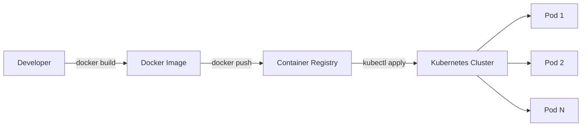
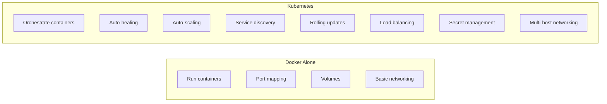
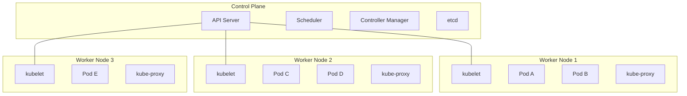
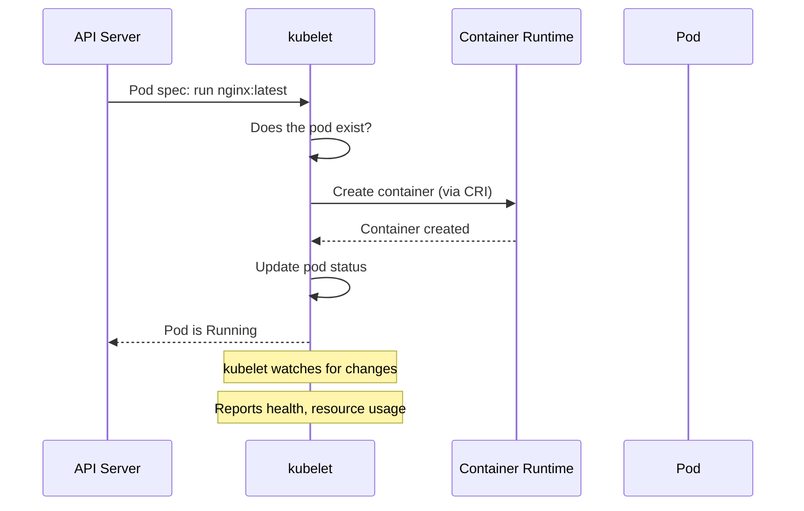
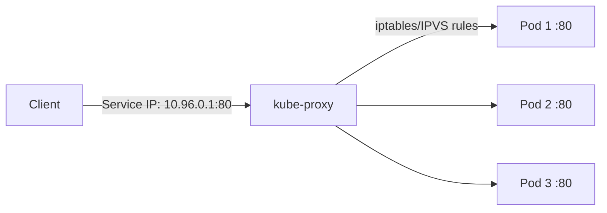
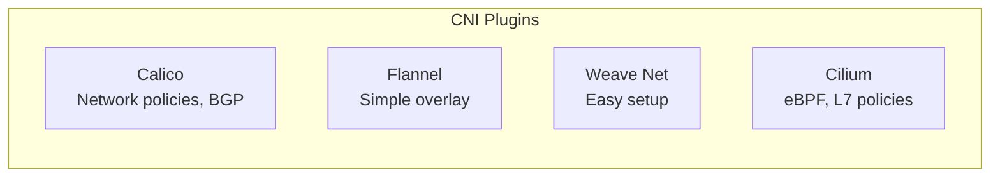
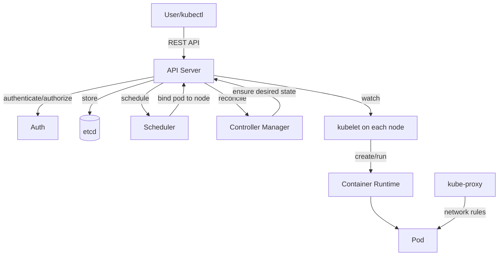

# 01 — Kubernetes Fundamentals

> The big picture — what Kubernetes is, how it's built, and why it matters

---

## Table of Contents

1. [What is Kubernetes?](#what-is-kubernetes)
2. [Why Kubernetes?](#why-kubernetes)
3. [Kubernetes Architecture](#kubernetes-architecture)
4. [Control Plane Components](#control-plane-components)
5. [Node Components](#node-components)
6. [Cluster Networking](#cluster-networking)
7. [Installation & Tools](#installation--tools)
8. [Your First Deployment](#your-first-deployment)

---

## What is Kubernetes?

**Kubernetes (K8s)** is an open-source platform for automating deployment, scaling, and management of containerized applications.

```
K - u - b - e - r - n - e - t - e - s
|   |   |   |   |   |   |   |   |   |
1   2   3   4   5   6   7   8   9   10
|___ ___ ___ ___ ___ ___ ___ ___ ___|
            8 letters → K8s
```



---

## Why Kubernetes?

### The Problems K8s Solves

| Problem | Without K8s | With K8s |
|---------|-------------|----------|
| **Container crash** | Manual restart | Auto-restarts |
| **High traffic** | Manual scaling | Auto-scaling |
| **Deployment** | SSH + script | Rolling updates |
| **Rollback** | Manual re-deploy | `kubectl rollout undo` |
| **Service discovery** | Hardcoded IPs | DNS-based |
| **Load balancing** | External LB config | Built-in |
| **Config management** | Env vars per host | ConfigMaps + Secrets |
| **Storage** | Manual volume attach | PVCs auto-provisioned |

### Docker vs Kubernetes



| Docker Does | Kubernetes Adds |
|-------------|-----------------|
| `docker run` | Declarative YAML |
| `docker compose up` | `kubectl apply -f` |
| Manual restart | Auto-restart on failure |
| Manual scaling | `kubectl scale` / HPA |
| Single host | Multi-cluster |

---

## Kubernetes Architecture



### Two Planes

| Plane | What it does | Runs on |
|-------|-------------|---------|
| **Control Plane** | Brain of the cluster — scheduling, API, state storage | Manager node(s) |
| **Data Plane (Workers)** | Runs your actual application containers | Worker nodes |

---

## Control Plane Components

### API Server (`kube-apiserver`)

The front door to the cluster. Every kubectl command, every internal component communication goes through the API server.

```bash
# The API server authenticates, authorizes, validates, and processes requests
kubectl get pods
# ↓
kubectl → API Server → etcd (store) → return response
```

| Feature | What it does |
|---------|-------------|
| **Authentication** | Who are you? (certs, tokens, OIDC) |
| **Authorization** | Can you do this? (RBAC, ABAC) |
| **Admission Control** | Should this request be modified/rejected? |
| **Validation** | Is the YAML correct? |
| **Storage** | Reads/writes to etcd |

### etcd

The cluster's source of truth — a distributed key-value store.

```
etcd stores:
├── /registry/pods/default/my-pod
├── /registry/deployments/default/my-app
├── /registry/services/default/my-service
├── /registry/configmaps/default/my-config
├── /registry/secrets/default/my-secret
└── /registry/nodes/
```

```bash
# Backup etcd (critical for disaster recovery)
kubectl exec -n kube-system etcd-minikube -- \
  etcdctl --endpoints=localhost:2379 \
  snapshot save /backup/etcd-snapshot.db
```

### Scheduler (`kube-scheduler`)

Decides which node a new pod should run on.

```
New Pod → Scheduler
           ├── Filtering (find feasible nodes)
           │   ├── Resource requests (CPU/memory)
           │   ├── Node affinity/taints
           │   └── Port conflicts
           ├── Scoring (rank feasible nodes)
           │   ├── Least resource usage
           │   ├── Pod affinity/anti-affinity
           │   └── Spread across zones
           └── Binding (assign pod to best node)
```

### Controller Manager (`kube-controller-manager`)

Runs controllers that ensure the cluster matches the desired state.

```
Controllers:
├── Node Controller       — Detects node failures
├── Replication Controller — Ensures correct replica count
├── Deployment Controller  — Manages rolling updates
├── StatefulSet Controller — Manages stateful workloads
├── DaemonSet Controller   — Runs pod on every node
├── Job Controller         — Runs batch jobs
├── Endpoint Controller    — Updates service endpoints
└── Service Account Controller — Creates default service accounts
```

---

## Node Components

### kubelet

The node agent. Ensures containers are running in pods.



### kube-proxy

Manages network rules so pods can communicate.



### Container Runtime

The software that actually runs containers (containerd, CRI-O, Docker).

```bash
# Check container runtime on a node
kubectl get nodes -o wide
# NAME       STATUS   CONTAINER-RUNTIME
# minikube   Ready    containerd://1.7.x
```

---

## Cluster Networking

### The Four Networking Requirements

| # | Requirement | How It's Solved |
|---|-------------|-----------------|
| 1 | **Pod-to-Pod** on same node | Bridge (cni0) |
| 2 | **Pod-to-Pod** across nodes | CNI plugin (Calico, Flannel, Weave) |
| 3 | **Pod-to-Service** | kube-proxy (iptables/IPVS) |
| 4 | **External-to-Service** | NodePort / LoadBalancer / Ingress |

### CNI Plugins



```bash
# Check CNI plugin
kubectl get pods -n kube-system | grep -i calico\|flannel\|cilium\|weave
```

---

## Installation & Tools

### Local Development

```bash
# Minikube (single-node cluster)
minikube start --cpus=4 --memory=4096

# Kind (Kubernetes in Docker)
kind create cluster --name mycluster

# K3s (lightweight)
curl -sfL https://get.k3s.io | sh -

# MicroK8s (Ubuntu)
sudo snap install microk8s --classic
```

### kubectl — The CLI

```bash
# Install kubectl
# Windows (winget)
winget install -e --id Kubernetes.kubectl

# macOS
brew install kubectl

# Linux
curl -LO "https://dl.k8s.io/release/$(curl -L -s https://dl.k8s.io/release/stable.txt)/bin/linux/amd64/kubectl"
```

### Essential Cluster Management

```bash
# Start/stop Minikube
minikube start
minikube stop
minikube delete

# Check cluster info
kubectl cluster-info
kubectl get nodes
kubectl get componentstatuses

# Get cluster events
kubectl get events --sort-by='.lastTimestamp'

# Check node resources
kubectl top nodes
kubectl describe node minikube
```

---

## Your First Deployment

```yaml
apiVersion: apps/v1
kind: Deployment
metadata:
  name: nginx-deployment
spec:
  replicas: 3
  selector:
    matchLabels:
      app: nginx
  template:
    metadata:
      labels:
        app: nginx
    spec:
      containers:
        - name: nginx
          image: nginx:alpine
          ports:
            - containerPort: 80
```

```yaml
apiVersion: v1
kind: Service
metadata:
  name: nginx-service
spec:
  selector:
    app: nginx
  ports:
    - port: 80
      targetPort: 80
  type: NodePort
```

```bash
# Deploy
kubectl apply -f deployment.yaml
kubectl apply -f service.yaml

# Check
kubectl get pods
kubectl get services

# Access
minikube service nginx-service
```

---

## Summary



| Component | Role | Runs On |
|-----------|------|---------|
| API Server | Front door, auth, validation | Control Plane |
| etcd | Key-value store (cluster state) | Control Plane |
| Scheduler | Assigns pods to nodes | Control Plane |
| Controller Manager | Maintains desired state | Control Plane |
| kubelet | Node agent, manages pods | Every Node |
| kube-proxy | Network proxy, load balancing | Every Node |
| Container Runtime | Runs containers (containerd) | Every Node |

---

## Next Steps

→ [02 — Pods & Containers Deep Dive](./02-pods-and-containers.md)
