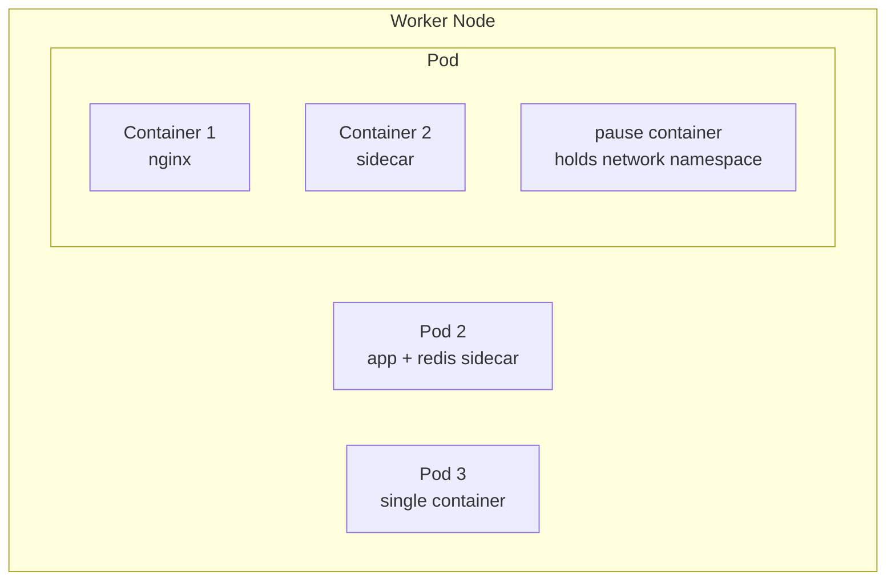
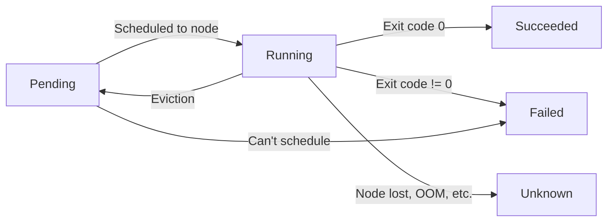
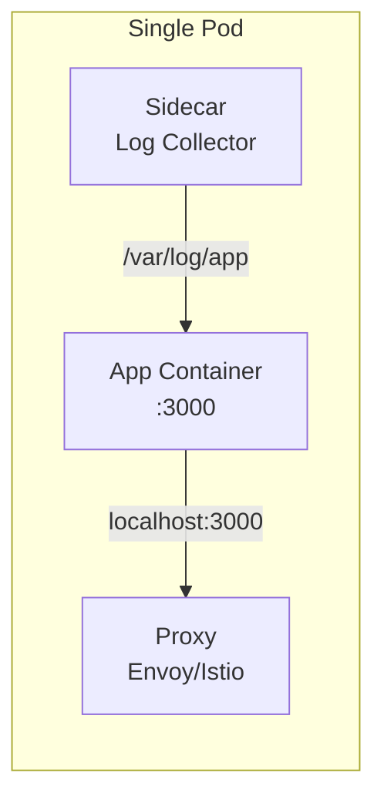
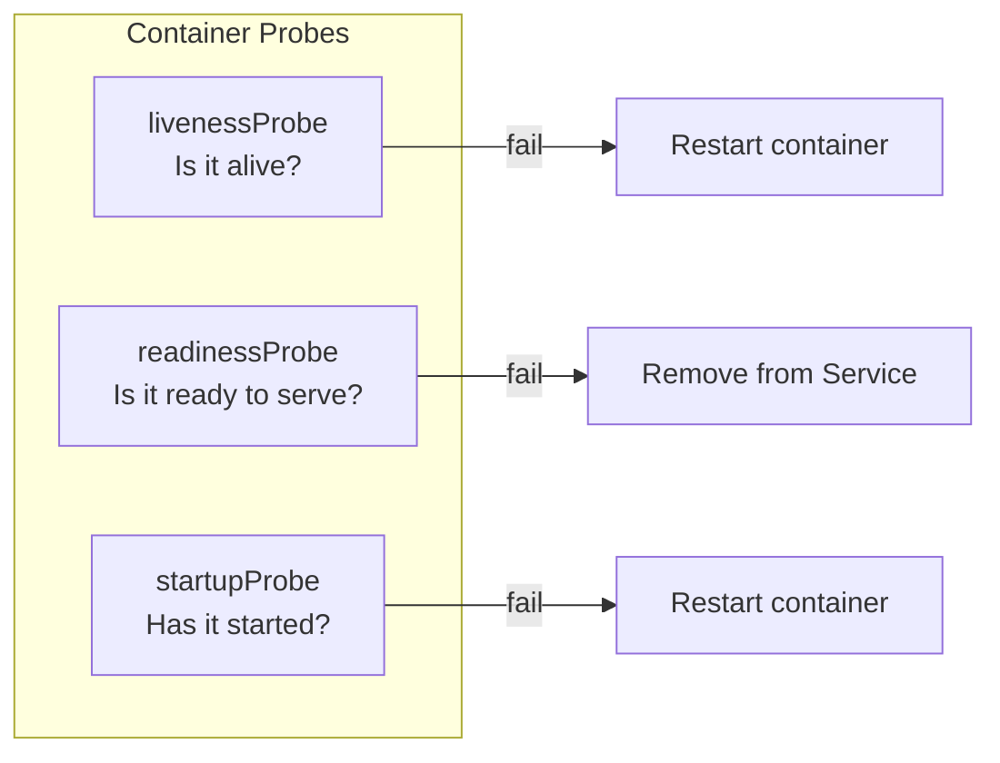
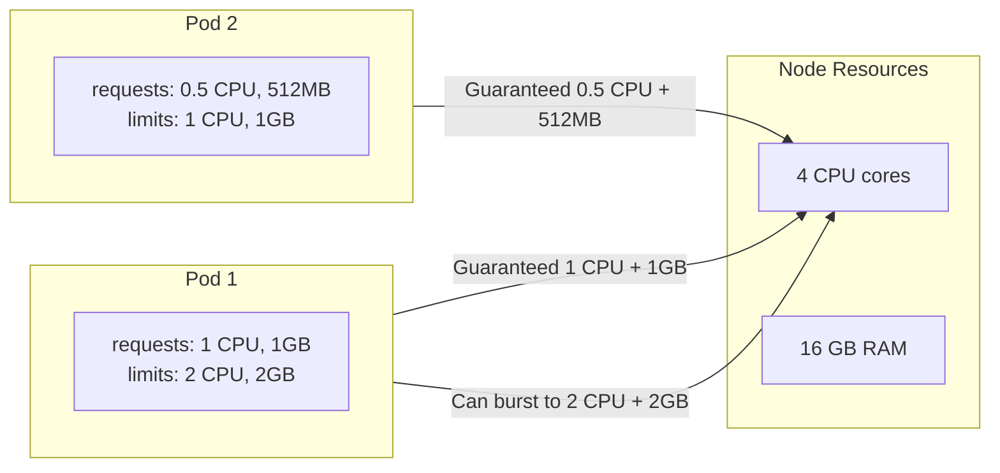

# 02 — Pods & Containers Deep Dive

> The smallest deployable unit — and everything around it

---

## Table of Contents

1. [What is a Pod?](#what-is-a-pod)
2. [Pod Lifecycle](#pod-lifecycle)
3. [Pod YAML Structure](#pod-yaml-structure)
4. [Multi-Container Pods](#multi-container-pods)
5. [Init Containers](#init-containers)
6. [Sidecar Containers](#sidecar-containers)
7. [Container Probes](#container-probes)
8. [Resource Requests & Limits](#resource-requests--limits)
9. [Pod Disruption Budgets](#pod-disruption-budgets)

---

## What is a Pod?

A **Pod** is the smallest deployable unit in Kubernetes. It represents a single instance of a running process.



### Pod vs Container

| Concept | Container | Pod |
|---------|-----------|-----|
| **What** | A process + filesystem | A group of containers |
| **IP** | Gets IP from Docker network | Gets unique IP in cluster |
| **Storage** | Container layer | Shared volumes across containers |
| **Lifecycle** | Short-lived | Can be restarted as a unit |
| **Scaling** | Manual | ReplicaSet/Deployment manages |

### Key Pod Characteristics

- Each pod gets a **unique cluster-wide IP**
- Containers in a pod share the **same network namespace** (same IP, localhost)
- Containers in a pod share the **same storage volumes**
- Pods are **ephemeral** — they can be killed and recreated at any time
- A pod runs on **exactly one node**

### The "Pause" Container

Every pod has an invisible `pause` container that holds the network namespace:

```
Pod:
├── pause (holds network namespace, PID 1)
├── app container (nginx)
├── sidecar container (log collector)
│
All containers share:
├── Network: 10.244.0.5
├── IPC namespace
├── PID namespace (shared optional)
└── Volumes
```

---

## Pod Lifecycle



### Pod Phases

| Phase | Description |
|-------|-------------|
| **Pending** | Accepted but not yet running (pulling image, waiting for resources) |
| **Running** | At least one container is running |
| **Succeeded** | All containers exited with code 0 |
| **Failed** | At least one container exited with non-0 |
| **Unknown** | Node communication lost |
| **CrashLoopBackOff** | Container keeps crashing, K8s backs off restart |

### Container States Inside a Pod

```bash
kubectl get pods -w
# NAME    READY   STATUS             RESTARTS   AGE
# mypod   0/1     Pending            0          2s
# mypod   0/1     ContainerCreating  0          5s
# mypod   1/1     Running            0          8s
# mypod   0/1     CrashLoopBackOff   1          15s
# mypod   0/1     CrashLoopBackOff   2          30s
```

### CrashLoopBackOff — Exponential Backoff

Restart attempts follow exponential backoff:
```
1st: 10s
2nd: 20s
3rd: 40s
4th: 80s
5th: 160s
... (max 300s)
Resets after 10 minutes of running
```

```bash
# Debug crash loop
kubectl logs mypod --previous          # Logs from previous instance
kubectl describe pod mypod              # Events / reason
kubectl get pod mypod -o yaml           # Full pod spec + status
```

---

## Pod YAML Structure

```yaml
apiVersion: v1
kind: Pod
metadata:
  name: myapp-pod
  namespace: default
  labels:
    app: myapp
    tier: frontend
  annotations:
    prometheus.io/scrape: "true"
spec:
  # Scheduling
  nodeSelector:
    disktype: ssd
  nodeName: worker-2                    # Direct assignment (bypass scheduler)
  affinity:
    nodeAffinity:
      requiredDuringSchedulingIgnoredDuringExecution:
        nodeSelectorTerms:
          - matchExpressions:
              - key: topology.kubernetes.io/zone
                operator: In
                values:
                  - us-east-1a
  tolerations:
    - key: "dedicated"
      operator: "Equal"
      value: "gpu"
      effect: "NoSchedule"

  # Containers
  containers:
    - name: app
      image: myapp:1.0.0
      imagePullPolicy: IfNotPresent     # Always, IfNotPresent, Never
      command: ["node"]                 # Override Dockerfile CMD
      args: ["server.js"]              # Arguments to command
      workingDir: /app
      ports:
        - containerPort: 3000
          name: http
          protocol: TCP
      env:
        - name: NODE_ENV
          value: "production"
        - name: DB_HOST
          valueFrom:
            configMapKeyRef:
              name: app-config
              key: db_host
        - name: DB_PASSWORD
          valueFrom:
            secretKeyRef:
              name: app-secret
              key: db_password
      resources:
        requests:
          memory: "64Mi"
          cpu: "250m"
        limits:
          memory: "128Mi"
          cpu: "500m"
      livenessProbe:
        httpGet:
          path: /healthz
          port: 3000
        initialDelaySeconds: 15
        periodSeconds: 20
      readinessProbe:
        httpGet:
          path: /readyz
          port: 3000
        initialDelaySeconds: 5
        periodSeconds: 10
      startupProbe:
        httpGet:
          path: /startup
          port: 3000
        initialDelaySeconds: 3
        periodSeconds: 5
        failureThreshold: 30
      volumeMounts:
        - name: data
          mountPath: /app/data
        - name: config
          mountPath: /app/config
          readOnly: true
      securityContext:
        runAsUser: 1000
        runAsGroup: 1000
        runAsNonRoot: true
        capabilities:
          drop: ["ALL"]
          add: ["NET_BIND_SERVICE"]

  # Init containers
  initContainers:
    - name: init-migrations
      image: myapp-migrations:1.0.0
      command: ["node", "migrate.js"]
      env:
        - name: DB_URL
          valueFrom:
            secretKeyRef:
              name: db-secret
              key: url

  # Volumes
  volumes:
    - name: data
      persistentVolumeClaim:
        claimName: myapp-pvc
    - name: config
      configMap:
        name: app-config

  # Security
  serviceAccountName: myapp-sa
  automountServiceAccountToken: true
  securityContext:
    fsGroup: 2000
    supplementalGroups: [3000]
  hostNetwork: false                    # Use host network (rare)

  # Restart policy
  restartPolicy: Always                 # Always, OnFailure, Never

  # Termination
  terminationGracePeriodSeconds: 30

  # DNS
  dnsPolicy: ClusterFirst
  dnsConfig:
    nameservers:
      - 1.1.1.1
    searches:
      - ns1.svc.cluster.local

  # Hostname
  hostname: myapp
  subdomain: myapp-subdomain
```

---

## Multi-Container Pods

### Why Multiple Containers in One Pod?



| Pattern | Container 1 | Container 2 | Why Share a Pod |
|---------|-------------|-------------|-----------------|
| **Sidecar** | Web app | Log collector | Same filesystem (shared volume) |
| **Proxy** | App | Envoy/Istio | Same network (localhost comm) |
| **Adapter** | App | Metrics converter | Same data, different format |
| **Ambassador** | App | Redis proxy | Abstract external service |

### Multi-Container Pod Example

```yaml
apiVersion: v1
kind: Pod
metadata:
  name: web-with-sidecar
spec:
  volumes:
    - name: logs
      emptyDir: {}

  containers:
    - name: web
      image: nginx:alpine
      ports:
        - containerPort: 80
      volumeMounts:
        - name: logs
          mountPath: /var/log/nginx

    - name: log-collector
      image: fluent/fluentd:v1.16
      volumeMounts:
        - name: logs
          mountPath: /logs
      command:
        - fluentd
        - -c
        - /fluentd/etc/fluent.conf
```

### Communication Between Containers

```
┌─────────────────────────────────┐
│          Pod                    │
│  ┌────────────────────┐         │
│  │ Container A        │         │
│  │ localhost:3000     │─────────│──► HTTP (same host)
│  └────────┬───────────┘         │
│           │ shared volume       │
│  ┌────────▼───────────┐         │
│  │ Container B        │         │
│  │ /var/log/app.log   │         │
│  └────────────────────┘         │
│                                 │
│  IP: 10.244.0.5                 │
└─────────────────────────────────┘
```

---

## Init Containers

**Init containers** run before app containers start. They must complete successfully before the pod moves to Running.

```yaml
apiVersion: v1
kind: Pod
metadata:
  name: app-with-init
spec:
  initContainers:
    - name: check-db
      image: curlimages/curl:latest
      command:
        - sh
        - -c
        - |
          until curl -sf http://db-service:5432; do
            echo "Waiting for DB..."
            sleep 2
          done
          echo "DB is ready!"

    - name: run-migrations
      image: myapp-migrations:latest
      env:
        - name: DATABASE_URL
          value: postgres://user:pass@db:5432/app

  containers:
    - name: app
      image: myapp:latest
      ports:
        - containerPort: 3000
```

### Init Container Characteristics

| Property | Init Container | Regular Container |
|----------|---------------|-------------------|
| **Order** | Runs first | Runs after init succeeds |
| **Restart** | Always completes (OnFailure) | Runs until stopped/crashes |
| **Resources** | Separate requests/limits | Separate requests/limits |
| **Lifecycle** | Starts fresh each pod startup | Continuous |
| **Use case** | Setup, migration, waiting | Application |

### Common Init Container Patterns

```yaml
# 1. Wait for dependencies
initContainers:
  - name: wait-for-db
    image: busybox:1.36
    command:
      - sh
      - -c
      - until nc -z db-service 5432; do sleep 2; done

# 2. Clone Git repo
initContainers:
  - name: clone-repo
    image: alpine/git:latest
    command: ["git", "clone", "https://github.com/org/repo.git", "/repo"]
    volumeMounts:
      - name: repo
        mountPath: /repo

# 3. Set permissions
initContainers:
  - name: set-permissions
    image: busybox:1.36
    command: ["chown", "-R", "1000:1000", "/data"]
    volumeMounts:
      - name: data
        mountPath: /data
```

---

## Sidecar Containers

Sidecars are regular containers that run alongside the main app, enhancing its capabilities.

### Log Collection Sidecar

```yaml
apiVersion: apps/v1
kind: DaemonSet
metadata:
  name: fluentd
spec:
  template:
    spec:
      containers:
        - name: fluentd
          image: fluent/fluentd:v1.16
          volumeMounts:
            - name: container-logs
              mountPath: /var/log/containers
      volumes:
        - name: container-logs
          hostPath:
            path: /var/log/containers
```

### Service Mesh Sidecar (Istio)

```yaml
# When Istio is enabled, it automatically injects an envoy sidecar:
spec:
  containers:
    - name: app
      image: myapp:latest
    - name: istio-proxy       # ← Auto-injected by Istio
      image: istio/proxyv2:latest
      args:
        - proxy
        - sidecar
        - --domain
        - $(POD_NAMESPACE).svc.cluster.local
```

---

## Container Probes

Kubernetes provides three types of probes to check container health.



### Probe Configuration

```yaml
readinessProbe:
  httpGet:
    path: /readyz
    port: 3000
    httpHeaders:
      - name: X-Custom-Header
        value: healthcheck
  initialDelaySeconds: 5      # Wait before first check
  periodSeconds: 10            # How often to check
  timeoutSeconds: 3            # Max wait for response
  successThreshold: 1          # Consecutive successes to mark healthy
  failureThreshold: 3          # Consecutive failures to mark unhealthy
```

### Probe Types

| Type | Mechanism | Use Case |
|------|-----------|----------|
| **HTTP** | `httpGet` — GET request | Web servers, APIs |
| **TCP** | `tcpSocket` — Port open | Databases, Redis |
| **Command** | `exec` — Run command, check exit code | Custom checks |

```yaml
# HTTP probe
livenessProbe:
  httpGet:
    path: /healthz
    port: 3000

# TCP probe
readinessProbe:
  tcpSocket:
    port: 5432
  initialDelaySeconds: 5
  periodSeconds: 10

# Exec probe
livenessProbe:
  exec:
    command:
      - pg_isready
      - -U
      - postgres
  initialDelaySeconds: 5
  periodSeconds: 10
```

### Startup Probe for Slow-Starting Apps

```yaml
startupProbe:
  httpGet:
    path: /startup
    port: 3000
  initialDelaySeconds: 3
  periodSeconds: 5
  failureThreshold: 30            # 30 * 5s = 150s max startup time
```

This prevents the liveness probe from killing a slow-starting app before it's ready.

---

## Resource Requests & Limits



### How Resources Work

| Concept | Requests | Limits |
|---------|----------|--------|
| **Guarantees** | Minimum resources reserved | Maximum resources allowed |
| **Scheduling** | Scheduler uses requests | Not used for scheduling |
| **CPU** | Guaranteed share | Can burst to limit, throttled if exceeded |
| **Memory** | Guaranteed allocation | **Killed (OOM)** if exceeded |
| **Example** | `requests: 256Mi` | `limits: 512Mi` |

### Resource Units

```yaml
# CPU
requests:
  cpu: "0.5"          # Half a core
  cpu: "500m"         # Same as 0.5 (millicores)
  cpu: "1"            # 1 full core
  cpu: "2.5"          # 2.5 cores

# Memory
requests:
  memory: "128Mi"     # 128 Mebibytes (binary)
  memory: "256M"      # 256 Megabytes (decimal)
  memory: "1Gi"       # 1 Gibibyte
  memory: "1G"        # 1 Gigabyte
```

### Quality of Service (QoS) Classes

| QoS Class | Requests = Limits? | Priority | Example |
|-----------|--------------------|----------|---------|
| **Guaranteed** | Yes (all resources) | Highest | `requests/cpu=1, limits/cpu=1` |
| **Burstable** | No | Medium | `requests/cpu=0.5, limits/cpu=1` |
| **BestEffort** | No requests/limits set | Lowest | No resource spec |

```bash
kubectl get pod mypod -o jsonpath='{.status.qosClass}'
# Guaranteed / Burstable / BestEffort
```

When a node runs out of memory, K8s kills pods in this order:
1. BestEffort
2. Burstable (exceeding their requests)
3. Guaranteed (exceeding their limits)
4. Guaranteed (within limits) — last to be killed

---

## Pod Disruption Budgets

A PDB limits the number of pods that can be unavailable at once during voluntary disruptions (node maintenance, cluster upgrades).

```yaml
apiVersion: policy/v1
kind: PodDisruptionBudget
metadata:
  name: myapp-pdb
spec:
  minAvailable: 2            # At least 2 pods must be running
  selector:
    matchLabels:
      app: myapp
```

```yaml
apiVersion: policy/v1
kind: PodDisruptionBudget
metadata:
  name: myapp-pdb
spec:
  maxUnavailable: 1          # At most 1 pod can be down
  selector:
    matchLabels:
      app: myapp
```

| Field | Meaning | Example |
|-------|---------|---------|
| `minAvailable` | Minimum pods that must be running | `2` or `50%` |
| `maxUnavailable` | Maximum pods that can be down | `1` or `25%` |

**Note:** PDBs do NOT protect against node failures (involuntary disruptions). They only protect against voluntary disruptions like `kubectl drain`.

---

## Summary

| Concept | Key Takeaway |
|---------|-------------|
| **Pod** | Smallest unit — one or more containers sharing IP + storage |
| **Init containers** | Run before app containers, must complete successfully |
| **Sidecars** | Helper containers that enhance the main app |
| **Probes** | liveness (restart), readiness (traffic), startup (slow start) |
| **Resources** | requests = guaranteed, limits = maximum (OOM if exceeded) |
| **QoS** | Guaranteed > Burstable > BestEffort (OOM kill order) |
| **PDB** | Protects against voluntary disruptions |

---

## Next Steps

→ [03 — Workload Resources](./03-workload-resources.md)
