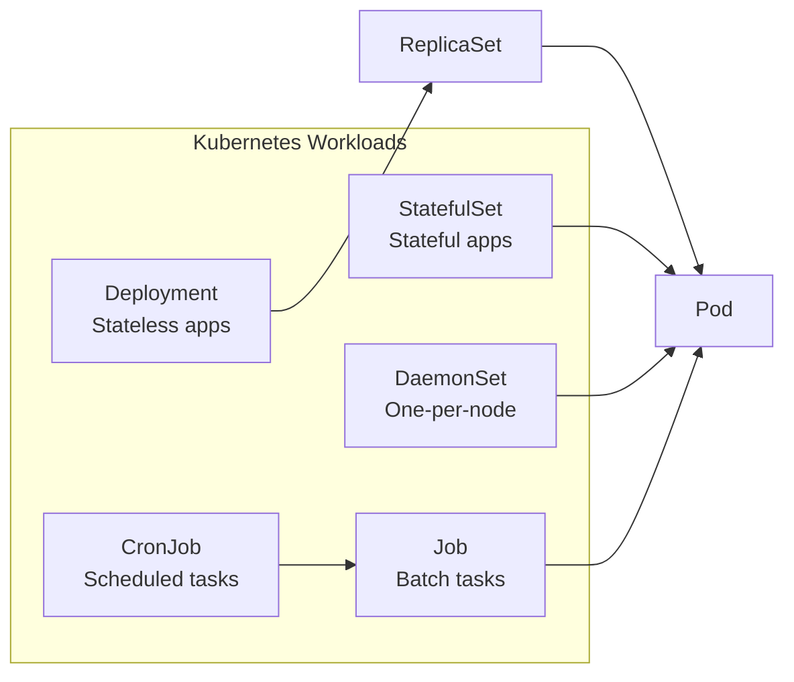
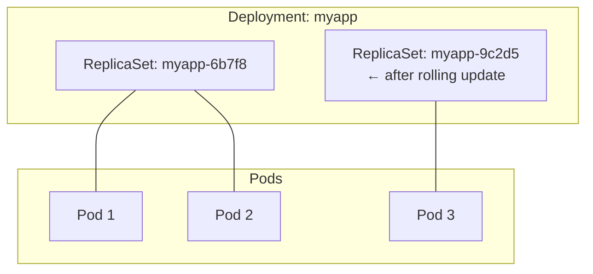
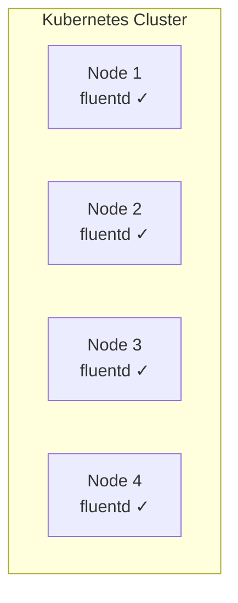
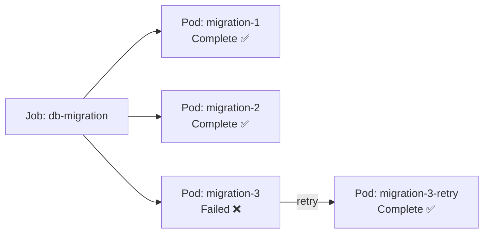
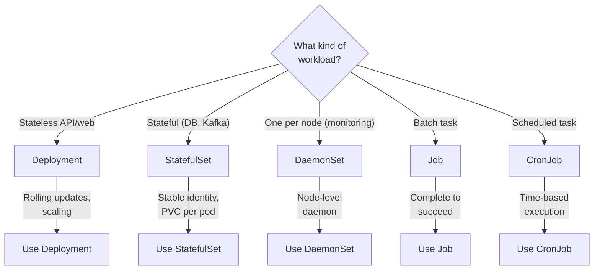

# 03 — Workload Resources

> Deployments, StatefulSets, DaemonSets, Jobs, and more

---

## Table of Contents

1. [Workload Resources Overview](#workload-resources-overview)
2. [Deployment](#deployment)
3. [ReplicaSet](#replicaset)
4. [StatefulSet](#statefulset)
5. [DaemonSet](#daemonset)
6. [Job](#job)
7. [CronJob](#cronjob)

---

## Workload Resources Overview



| Resource | Use Case | Scaling | Update Strategy |
|----------|----------|---------|-----------------|
| **Deployment** | Stateless apps (API, web) | Horizontal | Rolling update |
| **StatefulSet** | Stateful apps (DB, queue) | Horizontal with identity | Rolling update with persistence |
| **DaemonSet** | Node-level services (logging, monitoring) | Auto per node | Rolling update | 
| **Job** | Batch processing, migrations | Parallelism | Complete to succeed |
| **CronJob** | Scheduled tasks, backups | Time-based | Concurrency policy |

---

## Deployment

A **Deployment** manages a set of identical pods — the most common workload resource.



### Full Deployment YAML

```yaml
apiVersion: apps/v1
kind: Deployment
metadata:
  name: myapp
  namespace: default
  labels:
    app: myapp
    env: production
  annotations:
    kubernetes.io/change-cause: "Bump to v1.2.0"
spec:
  replicas: 3
  revisionHistoryLimit: 10               # Keep last 10 ReplicaSets for rollback

  strategy:
    type: RollingUpdate                  # RollingUpdate | Recreate
    rollingUpdate:
      maxSurge: 1                        # Pods above desired (1 or 25%)
      maxUnavailable: 0                  # Pods below desired (0 or 25%)

  selector:
    matchLabels:
      app: myapp
    matchExpressions:
      - { key: tier, operator: In, values: [frontend] }

  template:
    metadata:
      labels:
        app: myapp
        tier: frontend
    spec:
      containers:
        - name: app
          image: myapp:1.2.0
          imagePullPolicy: IfNotPresent
          ports:
            - containerPort: 3000
              name: http
          env:
            - name: NODE_ENV
              value: production
          resources:
            requests:
              cpu: 250m
              memory: 256Mi
            limits:
              cpu: 500m
              memory: 512Mi
          readinessProbe:
            httpGet:
              path: /readyz
              port: 3000
            initialDelaySeconds: 5
            periodSeconds: 10
          livenessProbe:
            httpGet:
              path: /healthz
              port: 3000
            initialDelaySeconds: 15
            periodSeconds: 20
      restartPolicy: Always
      terminationGracePeriodSeconds: 30
```

### Rolling Update Strategy

```yaml
strategy:
  type: RollingUpdate
  rollingUpdate:
    maxSurge: 1           # Can have 1 extra pod during update
    maxUnavailable: 0     # Must keep all pods running during update
```

```
Rollout of myapp:1.2.0 → myapp:1.3.0
Step 1: Create new ReplicaSet with 1 pod   (total: 4, ready: 3)
Step 2: Scale down old ReplicaSet to 2     (total: 3, ready: 3)
Step 3: Scale up new ReplicaSet to 2       (total: 4, ready: 3)
Step 4: Scale down old ReplicaSet to 1     (total: 3, ready: 3)
Step 5: Scale up new ReplicaSet to 3       (total: 4, ready: 4)
Step 6: Scale down old ReplicaSet to 0     (total: 3, ready: 3)
Done!
```

### Recreate Strategy

```yaml
strategy:
  type: Recreate
  # No rollingUpdate config — all pods are killed before new ones start
```

**When to use Recreate:** When you can't run two versions simultaneously (DB schema changes, file locks).

### Deployment Commands

```bash
# Create / Update
kubectl apply -f deployment.yaml
kubectl create deployment myapp --image=nginx:alpine --replicas=3

# Rollout management
kubectl rollout status deployment/myapp
kubectl rollout history deployment/myapp
kubectl rollout history deployment/myapp --revision=2
kubectl rollout undo deployment/myapp            # Rollback to previous
kubectl rollout undo deployment/myapp --to-revision=1

# Scaling
kubectl scale deployment/myapp --replicas=5
kubectl autoscale deployment/myapp --min=3 --max=10 --cpu-percent=80

# Update image (triggers rollout)
kubectl set image deployment/myapp app=myapp:1.3.0
kubectl edit deployment/myapp

# Pause / resume rollout (for canary testing)
kubectl rollout pause deployment/myapp
kubectl rollout resume deployment/myapp

# Restart pods (no image change — force re-create)
kubectl rollout restart deployment/myapp
```

### Rollback in Detail

```bash
# Check revision history
kubectl rollout history deployment/myapp
# REVISION  CHANGE-CAUSE
# 1         kubectl apply --record
# 2         kubectl set image ...
# 3         kubectl apply ...

# See details of a revision
kubectl rollout history deployment/myapp --revision=2

# Rollback to previous
kubectl rollout undo deployment/myapp

# Rollback to specific revision
kubectl rollout undo deployment/myapp --to-revision=1
```

**Note:** Revisions are stored in the ReplicaSets. `revisionHistoryLimit` controls how many are kept.

---

## ReplicaSet

A **ReplicaSet** ensures a specified number of pod replicas are running. Deployments manage ReplicaSets — you rarely create them directly.

```yaml
apiVersion: apps/v1
kind: ReplicaSet
metadata:
  name: myapp-6b7f8d9c4
  labels:
    app: myapp
spec:
  replicas: 3
  selector:
    matchLabels:
      app: myapp
  template:
    metadata:
      labels:
        app: myapp
    spec:
      containers:
        - name: app
          image: nginx:alpine
```

```bash
# ReplicaSets are managed by Deployments
kubectl get replicasets
kubectl delete replicaset myapp-6b7f8d9c4
# Don't delete ReplicaSets directly — the Deployment re-creates them
```

### ReplicaSet vs Deployment

| Feature | ReplicaSet | Deployment |
|---------|------------|------------|
| **Purpose** | Maintain replica count | Full deployment lifecycle |
| **Rolling updates** | No | Yes |
| **Rollback** | No | Yes |
| **Pause/resume** | No | Yes |
| **When to use** | Almost never directly | Always for stateless apps |

---

## StatefulSet

A **StatefulSet** manages stateful applications where each pod needs a unique identity and stable storage.

### When to Use StatefulSet

- Databases (PostgreSQL, MySQL, MongoDB)
- Message queues (Kafka, RabbitMQ)
- Distributed systems (ZooKeeper, Cassandra, Elasticsearch)
- Any app where "which pod am I?" matters

### Pod Identity — Stable Network Names

```
StatefulSet: mydb
┌────────────────────────┐
│ Pod 0: mydb-0          │  ← Always starts as mydb-0
│   ├── DNS: mydb-0.mydb │
│   └── PVC: data-mydb-0 │
├────────────────────────┤
│ Pod 1: mydb-1          │  ← Always starts as mydb-1
│   ├── DNS: mydb-1.mydb │
│   └── PVC: data-mydb-1 │
├────────────────────────┤
│ Pod 2: mydb-2          │  ← Always starts as mydb-2
│   ├── DNS: mydb-2.mydb │
│   └── PVC: data-mydb-2 │
└────────────────────────┘

DNS pattern: {pod-name}.{service-name}.{namespace}.svc.cluster.local
```

### StatefulSet YAML

```yaml
apiVersion: apps/v1
kind: StatefulSet
metadata:
  name: postgres
spec:
  serviceName: postgres              # Headless service that controls the domain
  replicas: 3
  selector:
    matchLabels:
      app: postgres

  # Pod management
  podManagementPolicy: OrderedReady  # OrderedReady | Parallel
  updateStrategy:
    type: RollingUpdate
    rollingUpdate:
      partition: 0                   # Only update pods with ordinal >= partition

  template:
    metadata:
      labels:
        app: postgres
    spec:
      containers:
        - name: postgres
          image: postgres:16-alpine
          ports:
            - containerPort: 5432
              name: postgres
          env:
            - name: POSTGRES_PASSWORD
              valueFrom:
                secretKeyRef:
                  name: pg-secret
                  key: password
          volumeMounts:
            - name: data
              mountPath: /var/lib/postgresql/data

  # VolumeClaimTemplate
  volumeClaimTemplates:
    - metadata:
        name: data
      spec:
        accessModes: ["ReadWriteOnce"]
        resources:
          requests:
            storage: 10Gi
        storageClassName: standard
```

### Ordered Pod Management

```yaml
podManagementPolicy: OrderedReady   # Default
```

```
Create:  mydb-0 → Running → mydb-1 → Running → mydb-2 → Running
Delete:  mydb-2 → Stopped → mydb-1 → Stopped → mydb-0 → Stopped
Scale Down: mydb-2 is deleted first (ordinal N-1)
```

```yaml
podManagementPolicy: Parallel
```

Create all pods in parallel. Delete all pods in parallel. Faster but riskier.

### Partitioned Rolling Update

```yaml
updateStrategy:
  type: RollingUpdate
  rollingUpdate:
    partition: 2              # Only pods with ordinal >= 2 are updated
```

```
Current State: postgres-0 (v1), postgres-1 (v1), postgres-2 (v1)
After update with partition=2:
  postgres-0 (v1)   ← unchanged
  postgres-1 (v1)   ← unchanged
  postgres-2 (v2)   ← updated

To roll out to all: update partition=0
```

Useful for canary testing stateful workloads.

### Headless Service for StatefulSet

```yaml
apiVersion: v1
kind: Service
metadata:
  name: postgres
spec:
  clusterIP: None                    # Headless — no load balancing
  selector:
    app: postgres
  ports:
    - port: 5432
      targetPort: 5432
```

Without `clusterIP: None`, the service gets a ClusterIP (load balancer). With `None`, DNS returns pod IPs directly, enabling peer discovery.

```bash
# Each pod gets a DNS entry:
# postgres-0.postgres.default.svc.cluster.local → 10.244.1.2
# postgres-1.postgres.default.svc.cluster.local → 10.244.2.3
```

---

## DaemonSet

A **DaemonSet** ensures every node (or a subset) runs exactly one copy of a pod.

### Use Cases

- **Log collection** (Fluentd, Logstash)
- **Monitoring** (Prometheus Node Exporter, Datadog Agent)
- **Networking** (Calico, Cilium, Flannel)
- **Security** (AppArmor, Falco)
- **Storage** (CSI drivers)



### DaemonSet YAML

```yaml
apiVersion: apps/v1
kind: DaemonSet
metadata:
  name: fluentd
  namespace: kube-system
spec:
  selector:
    matchLabels:
      name: fluentd
  template:
    metadata:
      labels:
        name: fluentd
    spec:
      tolerations:                        # Run on control-plane nodes too
        - key: node-role.kubernetes.io/control-plane
          effect: NoSchedule
      containers:
        - name: fluentd
          image: fluent/fluentd:v1.16
          resources:
            limits:
              memory: 200Mi
            requests:
              cpu: 100m
              memory: 200Mi
          volumeMounts:
            - name: varlog
              mountPath: /var/log
            - name: dockercontainers
              mountPath: /var/lib/docker/containers
              readOnly: true
      terminationGracePeriodSeconds: 30
      volumes:
        - name: varlog
          hostPath:
            path: /var/log
        - name: dockercontainers
          hostPath:
            path: /var/lib/docker/containers
```

### Run on Specific Nodes

```yaml
spec:
  template:
    spec:
      nodeSelector:
        disktype: ssd

      # Or using affinity
      affinity:
        nodeAffinity:
          requiredDuringSchedulingIgnoredDuringExecution:
            nodeSelectorTerms:
              - matchExpressions:
                  - key: kubernetes.io/hostname
                    operator: In
                    values:
                      - worker-node-3
```

### DaemonSet Commands

```bash
kubectl get daemonsets -n kube-system
kubectl describe daemonset fluentd -n kube-system
kubectl rollout restart daemonset fluentd -n kube-system
kubectl rollout status daemonset fluentd -n kube-system
```

---

## Job

A **Job** creates one or more pods and ensures they successfully complete.



### Job YAML

```yaml
apiVersion: batch/v1
kind: Job
metadata:
  name: db-migration
spec:
  completions: 3                       # Run 3 successful pods total
  parallelism: 2                       # Run up to 2 in parallel
  backoffLimit: 4                      # Retry up to 4 times on failure
  activeDeadlineSeconds: 300           # Max total time (5 min)
  ttlSecondsAfterFinished: 3600        # Clean up after 1 hour

  template:
    spec:
      restartPolicy: Never             # Never | OnFailure
      containers:
        - name: migration
          image: myapp-migrations:1.0.0
          env:
            - name: DATABASE_URL
              valueFrom:
                secretKeyRef:
                  name: db-secret
                  key: url
```

### Job Patterns

```yaml
# Single job (one pod, run once)
spec:
  completions: 1
  parallelism: 1

# Work queue (multiple pods, one completion)
spec:
  completions: 1
  parallelism: 5
  # 5 pods run in parallel, first one to complete marks the job done

# Parallel processing (N completions, M parallelism)
spec:
  completions: 10
  parallelism: 3
  # 10 total completions, 3 running at a time
```

### Job Commands

```bash
# Create job
kubectl apply -f job.yaml

# Watch job
kubectl get jobs -w
kubectl describe job db-migration

# Get pod logs
kubectl logs -l job-name=db-migration

# Delete job (deletes associated pods)
kubectl delete job db-migration

# Create a one-off job from command line
kubectl create job my-job --image=busybox -- echo "hello"
```

---

## CronJob

A **CronJob** runs jobs on a time-based schedule.

```yaml
apiVersion: batch/v1
kind: CronJob
metadata:
  name: backup-db
spec:
  schedule: "0 2 * * *"                # Cron expression: daily at 2 AM
  timeZone: "America/New_York"         # Explicit timezone (v1.25+)
  startingDeadlineSeconds: 600         # Max time to start if missed
  concurrencyPolicy: Forbid            # Forbid | Allow | Replace
  successfulJobsHistoryLimit: 3        # Keep last 3 successful jobs
  failedJobsHistoryLimit: 1            # Keep last 1 failed job
  suspend: false                       # Pause without deleting

  jobTemplate:
    spec:
      backoffLimit: 2
      template:
        spec:
          restartPolicy: Never
          containers:
            - name: backup
              image: postgres:16-alpine
              command:
                - sh
                - -c
                - pg_dump -h $DB_HOST -U $DB_USER $DB_NAME > /backup/db-$(date +%Y%m%d).sql
              env:
                - name: DB_HOST
                  value: postgres-service
                - name: DB_USER
                  value: postgres
                - name: DB_NAME
                  value: myapp
                - name: PGPASSWORD
                  valueFrom:
                    secretKeyRef:
                      name: pg-secret
                      key: password
```

### Cron Schedule Syntax

```
┌───────── minute (0-59)
│ ┌───────── hour (0-23)
│ │ ┌───────── day of month (1-31)
│ │ │ ┌───────── month (1-12)
│ │ │ │ ┌───────── day of week (0-6)
│ │ │ │ │
* * * * *
```

| Expression | Meaning |
|------------|---------|
| `0 2 * * *` | Daily at 2:00 AM |
| `*/5 * * * *` | Every 5 minutes |
| `0 0 * * 0` | Weekly on Sunday midnight |
| `0 6,18 * * *` | Every day at 6 AM and 6 PM |
| `0 0 1 * *` | Monthly on the 1st at midnight |

### Concurrency Policy

| Policy | Behavior |
|--------|----------|
| **Allow** | Multiple jobs can run concurrently |
| **Forbid** | Skip new job if previous is still running |
| **Replace** | Kill previous job, start new one on schedule |

### CronJob Commands

```bash
# Create
kubectl create cronjob backup --image=postgres:alpine --schedule="0 2 * * *" -- pg_dump ...

kubectl apply -f cronjob.yaml

# Watch
kubectl get cronjobs -w
kubectl describe cronjob backup-db

# Manually trigger a job from a cronjob
kubectl create job --from=cronjob/backup-db manual-backup-001

# Suspend / Resume
kubectl patch cronjob backup-db -p '{"spec":{"suspend":true}}'
kubectl patch cronjob backup-db -p '{"spec":{"suspend":false}}'

# Delete
kubectl delete cronjob backup-db
```

---

## Summary: When to Use What



| Resource | Stateless? | Stateful? | Node-Level? | Batch? |
|----------|------------|-----------|-------------|--------|
| **Deployment** | ✅ | ❌ | ❌ | ❌ |
| **StatefulSet** | ❌ | ✅ | ❌ | ❌ |
| **DaemonSet** | ❌ | ❌ | ✅ | ❌ |
| **Job** | ❌ | ❌ | ❌ | ✅ |
| **CronJob** | ❌ | ❌ | ❌ | ✅ (scheduled) |

---

## Next Steps

→ [04 — Services & Networking](./04-services-and-networking.md)
