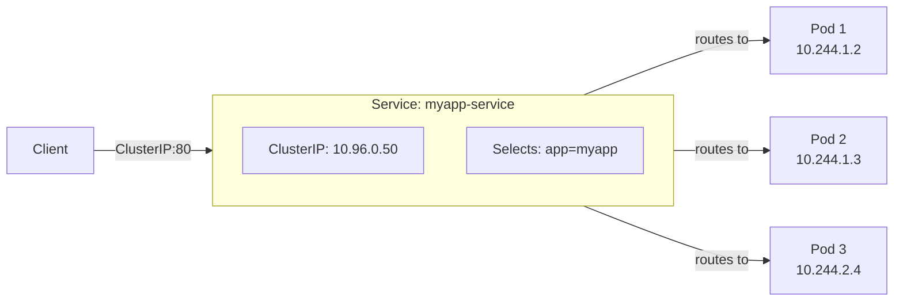
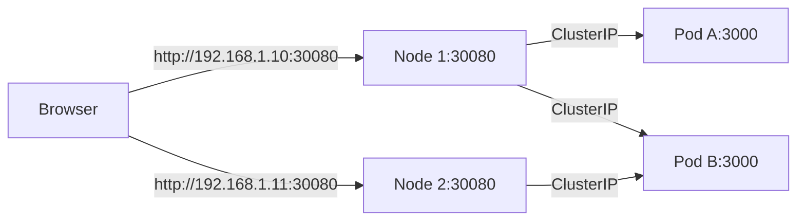
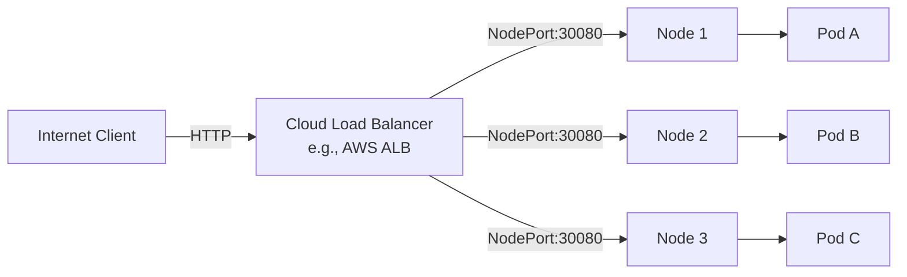
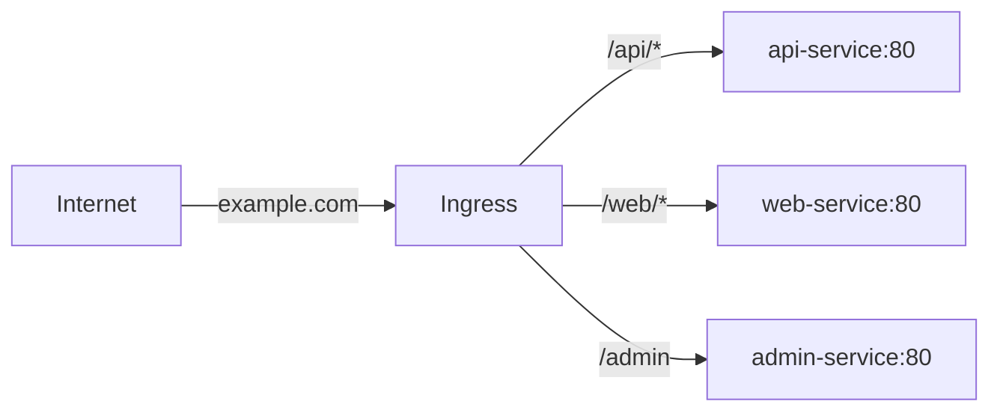

# 04 — Services & Networking

> How pods find each other and how traffic gets in

---

## Table of Contents

1. [Service Types](#service-types)
2. [ClusterIP Service](#clusterip-service)
3. [NodePort Service](#nodeport-service)
4. [LoadBalancer Service](#loadbalancer-service)
5. [Headless Service](#headless-service)
6. [Ingress](#ingress)
7. [DNS & Service Discovery](#dns--service-discovery)
8. [Network Policies](#network-policies)

---

## Service Types

A **Service** is an abstraction that defines a logical set of pods and a policy to access them.



### Service Types Comparison

| Type | Internal Access | External Access | Use Case |
|------|----------------|-----------------|----------|
| **ClusterIP** | ✅ Cluster-internal IP | ❌ | Internal APIs, microservices |
| **NodePort** | ✅ Cluster-internal IP | ✅ nodeIP:NodePort | Dev/testing, direct access |
| **LoadBalancer** | ✅ Cluster-internal IP | ✅ LB hostname | Production (cloud) |
| **ExternalName** | ✅ DNS alias | ❌ (returns CNAME) | External service proxy |

---

## ClusterIP Service

The default service type — exposes pods on a cluster-internal IP.

```yaml
apiVersion: v1
kind: Service
metadata:
  name: myapp-service
spec:
  type: ClusterIP                  # Default — can omit
  selector:
    app: myapp
    tier: backend
  ports:
    - port: 80                     # Service port
      targetPort: 3000             # Container port
      protocol: TCP
      name: http
    - port: 443
      targetPort: 8443
      name: https
```

### How ClusterIP Works

```
          Client Pod
              │
              │ curl http://myapp-service:80
              ▼
        ┌─────────────────┐
        │  kube-proxy      │
        │  iptables rules: │
        │  10.96.0.50:80  │
        │  → random pod   │
        └────────┬────────┘
                 │
       ┌─────────┼──────────┐
       ▼         ▼          ▼
   Pod A:80   Pod B:80   Pod C:80
```

### Session Affinity (Sticky Sessions)

```yaml
spec:
  sessionAffinity: ClientIP         # Route same client to same pod
  sessionAffinityConfig:
    clientIP:
      timeoutSeconds: 10800         # 3 hours
```

---

## NodePort Service

Exposes the service on each node's IP at a static port.

```yaml
apiVersion: v1
kind: Service
metadata:
  name: myapp-nodeport
spec:
  type: NodePort
  selector:
    app: myapp
  ports:
    - port: 80                     # ClusterIP port
      targetPort: 3000             # Container port
      nodePort: 30080              # Node port (30000-32767) — optional, K8s picks if omitted
```



```bash
# Get NodePort
kubectl get service myapp-nodeport
# NAME             TYPE       CLUSTER-IP   PORT(S)          AGE
# myapp-nodeport   NodePort   10.96.0.10   80:30080/TCP    5m

# Access via Minikube
minikube service myapp-nodeport

# Get the URL
minikube service myapp-nodeport --url
```

---

## LoadBalancer Service

Creates an external load balancer (cloud provider specific).

```yaml
apiVersion: v1
kind: Service
metadata:
  name: myapp-lb
spec:
  type: LoadBalancer
  selector:
    app: myapp
  ports:
    - port: 80
      targetPort: 3000
  # Cloud-specific annotations
  annotations:
    service.beta.kubernetes.io/aws-load-balancer-type: "alb"
    service.beta.kubernetes.io/aws-load-balancer-scheme: "internet-facing"
```



```bash
# After creation, the LB gets an external IP/hostname
kubectl get service myapp-lb -w
# NAME       TYPE           CLUSTER-IP   EXTERNAL-IP       PORT(S)
# myapp-lb   LoadBalancer   10.96.0.20   <pending>         80:30080/TCP
# myapp-lb   LoadBalancer   10.96.0.20   a1b2c3-12345.elb  80:30080/TCP
```

### LoadBalancer on Minikube

```bash
# Minikube doesn't have a cloud LB, but you can use tunnel:
minikube tunnel
# This assigns a local IP to LoadBalancer services

kubectl get svc myapp-lb
# NAME       TYPE           CLUSTER-IP   EXTERNAL-IP
# myapp-lb   LoadBalancer   10.96.0.20   127.0.0.1
```

---

## Headless Service

A service without `clusterIP` — used for StatefulSets and service discovery.

```yaml
apiVersion: v1
kind: Service
metadata:
  name: myapp-headless
spec:
  clusterIP: None                    # ← Makes it headless
  selector:
    app: myapp
  ports:
    - port: 3000
```

### How Headless Works

```
Normal Service:               Headless Service:
myapp-service                  myapp-headless
  ↓ DNS A Record                 ↓ DNS A Records
  10.96.0.50 (VIP)               10.244.1.2  (pod-0)
                                  10.244.1.3  (pod-1)
                                  10.244.2.4  (pod-2)
```

```bash
kubectl run -it --rm dnsutils --image=gcr.io/kubernetes-e2e-test-images/dnsutils:1.3 -- sh

# Normal service — returns VIP
/ # nslookup myapp-service
Server:    10.96.0.10
Address:   10.96.0.10:53
Name:      myapp-service.default.svc.cluster.local
Address:   10.96.0.50              ← Single VIP

# Headless service — returns pod IPs
/ # nslookup myapp-headless
Server:    10.96.0.10
Address:   10.96.0.10:53
Name:      myapp-headless.default.svc.cluster.local
Address:   10.244.1.2              ← Pod IP
Address:   10.244.1.3              ← Pod IP
Address:   10.244.2.4              ← Pod IP
```

---

## Ingress

Ingress exposes HTTP/HTTPS routes from outside the cluster to services within.



### Basic Ingress

```yaml
apiVersion: networking.k8s.io/v1
kind: Ingress
metadata:
  name: myapp-ingress
  annotations:
    nginx.ingress.kubernetes.io/rewrite-target: /
spec:
  ingressClassName: nginx
  rules:
    - host: myapp.example.com
      http:
        paths:
          - path: /api
            pathType: Prefix
            backend:
              service:
                name: api-service
                port:
                  number: 3000
          - path: /
            pathType: Prefix
            backend:
              service:
                name: web-service
                port:
                  number: 80
```

### TLS Ingress

```yaml
apiVersion: networking.k8s.io/v1
kind: Ingress
metadata:
  name: secure-ingress
spec:
  ingressClassName: nginx
  tls:
    - hosts:
        - secure.example.com
      secretName: tls-secret           # Must have tls.crt + tls.key
  rules:
    - host: secure.example.com
      http:
        paths:
          - path: /
            pathType: Prefix
            backend:
              service:
                name: secure-service
                port:
                  number: 443
```

### Ingress Annotations (NGINX)

```yaml
metadata:
  annotations:
    nginx.ingress.kubernetes.io/rewrite-target: /$2
    nginx.ingress.kubernetes.io/ssl-redirect: "true"
    nginx.ingress.kubernetes.io/cors-allow-origin: "*"
    nginx.ingress.kubernetes.io/limit-rps: "100"
    nginx.ingress.kubernetes.io/proxy-body-size: "50m"
    nginx.ingress.kubernetes.io/affinity: "cookie"
    cert-manager.io/cluster-issuer: "letsencrypt-prod"
```

### Path Types

| Path Type | Behavior | Example |
|-----------|----------|---------|
| **Prefix** | Match URL prefix | `/api` matches `/api/users`, `/api/v1/health` |
| **Exact** | Exact match only | `/health` matches only `/health` |
| **ImplementationSpecific** | Depends on ingress controller | NGINX treats as Prefix |

### Ingress Controller

Ingress doesn't work without an **Ingress Controller**:

```bash
# Install NGINX Ingress Controller
kubectl apply -f https://raw.githubusercontent.com/kubernetes/ingress-nginx/main/deploy/static/provider/cloud/deploy.yaml

# On Minikube
minikube addons enable ingress

# Check
kubectl get pods -n ingress-nginx
```

---

## DNS & Service Discovery

Kubernetes has built-in DNS (CoreDNS). Every service gets a DNS name.

### DNS Naming

```
{service}.{namespace}.svc.cluster.local
  myapp      default   svc  cluster    local
```

```bash
# From within any pod:
curl http://myapp-service                 # Same namespace
curl http://myapp-service.default         # Full namespace
curl http://myapp-service.default.svc     # Cluster domain
curl http://myapp-service.default.svc.cluster.local  # Fully qualified

# Pod DNS (via headless service):
curl http://pod-name.service-name.namespace.svc.cluster.local:3000
```

### Pod DNS

```yaml
spec:
  dnsPolicy: ClusterFirst           # Default — use cluster DNS first, then upstream
  # dnsPolicy: Default              # Use node's DNS
  # dnsPolicy: None                 # Custom DNS config
  dnsConfig:
    nameservers:
      - 1.1.1.1
    searches:
      - default.svc.cluster.local
      - svc.cluster.local
    options:
      - name: ndots
        value: "2"
```

### CoreDNS

```bash
# Check CoreDNS pods
kubectl get pods -n kube-system -l k8s-app=kube-dns

# Check CoreDNS config
kubectl get configmap coredns -n kube-system -o yaml

# Debug DNS from a pod
kubectl run -it --rm test --image=busybox:1.36 -- sh
/ # nslookup kubernetes
/ # cat /etc/resolv.conf
```

---

## Network Policies

Network Policies control traffic flow between pods.

### Default: Allow All

By default, all pods can communicate with all other pods. Network Policies add **deny rules**.

### Network Policy YAML

```yaml
apiVersion: networking.k8s.io/v1
kind: NetworkPolicy
metadata:
  name: api-policy
  namespace: default
spec:
  podSelector:
    matchLabels:
      role: api
  policyTypes:
    - Ingress
    - Egress
  ingress:
    - from:
        - podSelector:
            matchLabels:
              role: frontend
        - namespaceSelector:
            matchLabels:
              name: monitoring
      ports:
        - protocol: TCP
          port: 3000
  egress:
    - to:
        - podSelector:
            matchLabels:
              role: database
      ports:
        - protocol: TCP
          port: 5432
```

### Policy Patterns

```yaml
# Deny all ingress
apiVersion: networking.k8s.io/v1
kind: NetworkPolicy
metadata:
  name: deny-all
spec:
  podSelector: {}
  policyTypes:
    - Ingress
  # No ingress rules = deny all ingress

# Allow all ingress (default-allow)
apiVersion: networking.k8s.io/v1
kind: NetworkPolicy
metadata:
  name: allow-all
spec:
  podSelector: {}
  ingress:
    - {}
  policyTypes:
    - Ingress

# Allow only from specific namespace
apiVersion: networking.k8s.io/v1
kind: NetworkPolicy
metadata:
  name: allow-from-monitoring
spec:
  podSelector:
    matchLabels:
      app: api
  ingress:
    - from:
        - namespaceSelector:
            matchLabels:
              kubernetes.io/metadata.name: monitoring
      ports:
        - port: 9090

# Allow only from pods with specific label
apiVersion: networking.k8s.io/v1
kind: NetworkPolicy
metadata:
  name: allow-from-frontend
spec:
  podSelector:
    matchLabels:
      app: backend
  ingress:
    - from:
        - podSelector:
            matchLabels:
              app: frontend
      ports:
        - port: 3000
```

### Important Notes

- **Network Policies require a CNI plugin** that supports them (Calico, Cilium, Weave Net)
- Flannel does NOT support Network Policies
- Policies are **additive** — if multiple policies select a pod, the union of rules applies
- If no policy selects a pod, **all traffic is allowed** (default behavior)

```bash
# Check if your CNI supports Network Policies
kubectl get pods -n kube-system | grep -E "calico|cilium|weave|antrea"
```

---

## Summary

| Service Type | Internal | External | LB | Use Case |
|-------------|----------|----------|----|----------|
| **ClusterIP** | ✅ | ❌ | ❌ | Internal microservices |
| **NodePort** | ✅ | ✅ node:port | ❌ | Dev/test, direct access |
| **LoadBalancer** | ✅ | ✅ LB hostname | ✅ | Production cloud |
| **Headless (None)** | ✅ pod IPs | ❌ | ❌ | StatefulSets, discovery |

| Feature | Description |
|---------|-------------|
| **Ingress** | HTTP/HTTPS routing to services |
| **DNS** | Built-in service discovery (CoreDNS) |
| **NetworkPolicy** | Firewall rules between pods |

---

## Next Steps

→ [05 — Configuration & Secrets](./05-configuration-and-secrets.md)
