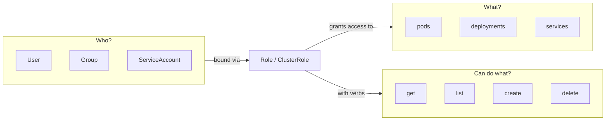

# 05 — Configuration & Secrets

> ConfigMaps, Secrets, ServiceAccounts, and RBAC

---

## Table of Contents

1. [ConfigMaps](#configmaps)
2. [Secrets](#secrets)
3. [ServiceAccounts](#serviceaccounts)
4. [RBAC](#rbac)
5. [Security Context](#security-context)

---

## ConfigMaps

ConfigMaps store **non-sensitive** configuration data as key-value pairs.

### Creating ConfigMaps

```bash
# From literal values
kubectl create configmap app-config \
  --from-literal=NODE_ENV=production \
  --from-literal=LOG_LEVEL=info

# From file (file name = key, file content = value)
kubectl create configmap app-config \
  --from-file=config.json

# From .env file
kubectl create configmap app-config \
  --from-env-file=.env.production

# From directory (all files in dir become keys)
kubectl create configmap app-config \
  --from-file=./configs/
```

### ConfigMap YAML

```yaml
apiVersion: v1
kind: ConfigMap
metadata:
  name: app-config
  labels:
    app: myapp
data:
  # Key-value pairs
  NODE_ENV: production
  LOG_LEVEL: info
  API_URL: https://api.example.com

  # Multi-line values
  nginx.conf: |
    server {
      listen 80;
      location / {
        proxy_pass http://backend:3000;
      }
    }

  # JSON
  database.json: |
    {
      "host": "db.example.com",
      "port": 5432,
      "name": "myapp"
    }
```

### Using ConfigMaps in Pods

```yaml
apiVersion: v1
kind: Pod
metadata:
  name: configmap-demo
spec:
  containers:
    - name: app
      image: myapp:latest

      # Option 1: As environment variables
      env:
        - name: NODE_ENV                # Env var name
          valueFrom:
            configMapKeyRef:
              name: app-config           # ConfigMap name
              key: NODE_ENV             # ConfigMap key
              optional: false           # Fail if key missing

      # Option 2: All env vars from a ConfigMap
      envFrom:
        - configMapRef:
            name: app-config
            optional: true              # Don't fail if ConfigMap missing
        - prefix: CFG_                  # Add prefix to env var names
          configMapRef:
            name: legacy-config

      # Option 3: As files mounted in a volume
      volumeMounts:
        - name: config-volume
          mountPath: /etc/config
          readOnly: true

  volumes:
    - name: config-volume
      configMap:
        name: app-config
        items:                          # Select specific keys
          - key: nginx.conf
            path: nginx/nginx.conf      # File path within mount
          - key: database.json
            path: database.json
        defaultMode: 0644
```

### ConfigMap Update Behavior

```bash
# Updating a ConfigMap
kubectl create configmap app-config --from-literal=LOG_LEVEL=debug --dry-run=client -o yaml | kubectl apply -f -

# Mounted files get updated automatically (eventually)
# Environment variables do NOT get updated — pod must be restarted
kubectl rollout restart deployment myapp
```

---

## Secrets

Secrets store **sensitive** data — passwords, tokens, keys. Values are base64-encoded (not encrypted).

```bash
# Create from literal
kubectl create secret generic db-secret \
  --from-literal=username=admin \
  --from-literal=password=s3cret!

# Create from file
kubectl create secret generic tls-secret \
  --from-file=tls.crt=server.crt \
  --from-file=tls.key=server.key

# Create from .env file
kubectl create secret generic app-secret \
  --from-env-file=.env.secret
```

### Secret YAML

```yaml
apiVersion: v1
kind: Secret
metadata:
  name: db-secret
type: Opaque                        # Opaque | kubernetes.io/tls | kubernetes.io/dockerconfigjson
data:
  username: YWRtaW4=                # base64("admin")
  password: czNjcjV0IQ==            # base64("s3cr5t!")
stringData:                         # Plain text (K8s encodes to base64 automatically)
  api_key: sk-live-abc123           # Never commit this to Git!
```

```bash
# Decode a secret
kubectl get secret db-secret -o jsonpath='{.data.password}' | base64 --decode
```

### Secret Types

| Type | Use Case | Data Fields |
|------|----------|-------------|
| **Opaque** | Arbitrary secrets | Any keys |
| **kubernetes.io/tls** | TLS certificates | `tls.crt`, `tls.key` |
| **kubernetes.io/dockerconfigjson** | Docker registry auth | `.dockerconfigjson` |
| **kubernetes.io/basic-auth** | Basic auth credentials | `username`, `password` |
| **kubernetes.io/ssh-auth** | SSH keys | `ssh-privatekey` |
| **bootstrap.kubernetes.io/token** | Bootstrap tokens | `token-id`, `token-secret` |

### Using Secrets in Pods

```yaml
apiVersion: v1
kind: Pod
metadata:
  name: secret-demo
spec:
  containers:
    - name: app
      image: myapp:latest

      # Option 1: As environment variables
      env:
        - name: DB_USERNAME
          valueFrom:
            secretKeyRef:
              name: db-secret
              key: username
        - name: DB_PASSWORD
          valueFrom:
            secretKeyRef:
              name: db-secret
              key: password
              optional: true

      # Option 2: All keys as env vars
      envFrom:
        - secretRef:
            name: db-secret

      # Option 3: As files (most secure)
      volumeMounts:
        - name: secret-volume
          mountPath: /etc/secrets
          readOnly: true

  volumes:
    - name: secret-volume
      secret:
        secretName: db-secret
        defaultMode: 0400              # Read-only for owner
        items:
          - key: username
            path: db/username
          - key: password
            path: db/password
```

### Security Best Practices

| Practice | Why |
|----------|-----|
| Use **external secrets** in production | K8s Secrets are only base64 encoded |
| **Don't commit** raw secrets to Git | Anyone with cluster access can read them |
| Use **Secrets Store CSI Driver** | Mount secrets from AWS/GCP/Azure/HashiCorp Vault |
| Enable **encryption at rest** for etcd | `kube-apiserver --encryption-provider-config` |
| Use **RBAC** to limit secret access | `get` secrets → can decode them |
| **Rotate secrets** regularly | Minimize blast radius of leaks |

### External Secrets Operator

```yaml
apiVersion: external-secrets.io/v1beta1
kind: ExternalSecret
metadata:
  name: aws-secret
spec:
  secretStoreRef:
    name: aws-secrets-manager
    kind: SecretStore
  target:
    name: db-secret                     # Creates a native K8s Secret
  data:
    - secretKey: username
      remoteRef:
        key: /prod/db/credentials
        property: username
    - secretKey: password
      remoteRef:
        key: /prod/db/credentials
        property: password
```

---

## ServiceAccounts

A **ServiceAccount** provides an identity for processes running in a pod.

```yaml
apiVersion: v1
kind: ServiceAccount
metadata:
  name: myapp-sa
  namespace: default
  annotations:
    eks.amazonaws.com/role-arn: arn:aws:iam::123456789:role/myapp-role
```

```bash
# Create
kubectl create serviceaccount myapp-sa

# List
kubectl get serviceaccounts

# The default SA is created automatically
kubectl get serviceaccount default
```

### Using a ServiceAccount in a Pod

```yaml
apiVersion: v1
kind: Pod
metadata:
  name: myapp
spec:
  serviceAccountName: myapp-sa
  automountServiceAccountToken: true    # Mount API credentials (default: true)
  containers:
    - name: app
      image: myapp:latest
```

### ServiceAccount Token

Each SA has a token that the pod uses to authenticate with the API server:

```bash
# Pod can read its own token
kubectl exec myapp -- cat /var/run/secrets/kubernetes.io/serviceaccount/token
kubectl exec myapp -- cat /var/run/secrets/kubernetes.io/serviceaccount/ca.crt
kubectl exec myapp -- cat /var/run/secrets/kubernetes.io/serviceaccount/namespace
```

---

## RBAC

**RBAC (Role-Based Access Control)** controls who can access what in the cluster.



### Role (Namespaced)

```yaml
apiVersion: rbac.authorization.k8s.io/v1
kind: Role
metadata:
  name: pod-reader
  namespace: default
rules:
  - apiGroups: [""]                    # Core API group
    resources: ["pods"]                # Resources to access
    verbs: ["get", "list", "watch"]    # Allowed actions
  - apiGroups: ["apps"]
    resources: ["deployments"]
    verbs: ["get", "list"]
    resourceNames: ["myapp"]           # Restrict to specific resource
```

### ClusterRole (Cluster-Wide)

```yaml
apiVersion: rbac.authorization.k8s.io/v1
kind: ClusterRole
metadata:
  name: cluster-reader
rules:
  - apiGroups: [""]
    resources: ["nodes", "persistentvolumes", "namespaces"]
    verbs: ["get", "list", "watch"]
  - apiGroups: ["metrics.k8s.io"]
    resources: ["pods"]
    verbs: ["get", "list"]
```

### RoleBinding

```yaml
apiVersion: rbac.authorization.k8s.io/v1
kind: RoleBinding
metadata:
  name: pod-reader-binding
  namespace: default
subjects:
  - kind: User
    name: "alice@example.com"
    apiGroup: rbac.authorization.k8s.io
  - kind: ServiceAccount
    name: myapp-sa
    namespace: default
  - kind: Group
    name: "developers"
    apiGroup: rbac.authorization.k8s.io
roleRef:
  kind: Role
  name: pod-reader
  apiGroup: rbac.authorization.k8s.io
```

### ClusterRoleBinding

```yaml
apiVersion: rbac.authorization.k8s.io/v1
kind: ClusterRoleBinding
metadata:
  name: cluster-reader-binding
subjects:
  - kind: User
    name: "ops@example.com"
    apiGroup: rbac.authorization.k8s.io
roleRef:
  kind: ClusterRole
  name: cluster-reader
  apiGroup: rbac.authorization.k8s.io
```

### Role vs ClusterRole

| Aspect | Role | ClusterRole |
|--------|------|-------------|
| **Scope** | Specific namespace | Entire cluster |
| **Resources** | Namespaced (pods, services) | Namespaced + cluster-wide (nodes, PVs) |
| **Non-resource URLs** | ❌ | ✅ (e.g., `/healthz`, `/api`) |
| **Binding** | RoleBinding | RoleBinding (namespace) or ClusterRoleBinding |

### Common Built-in ClusterRoles

| Role | Permissions |
|------|-------------|
| **cluster-admin** | Full access to everything |
| **admin** | Full access within a namespace |
| **edit** | Can modify resources in a namespace |
| **view** | Read-only in a namespace |

```bash
kubectl describe clusterrolebinding cluster-admin
kubectl describe clusterrole cluster-admin
```

### RBAC Commands

```bash
# Check who can do what
kubectl auth can-i create deployments
kubectl auth can-i delete pods --as=system:serviceaccount:default:myapp-sa
kubectl auth can-i get pods --all-namespaces --as=alice@example.com

# Check for current user
kubectl auth whoami

# View RBAC resources
kubectl get roles
kubectl get rolebindings
kubectl get clusterroles
kubectl get clusterrolebindings

# Describe
kubectl describe role pod-reader
kubectl describe rolebinding pod-reader-binding
```

### RBAC for ServiceAccount Example

```yaml
# 1. Create a service account
apiVersion: v1
kind: ServiceAccount
metadata:
  name: ci-deployer
  namespace: default
---
# 2. Create a role
apiVersion: rbac.authorization.k8s.io/v1
kind: Role
metadata:
  name: deployer
  namespace: default
rules:
  - apiGroups: ["apps"]
    resources: ["deployments"]
    verbs: ["get", "list", "watch", "create", "update", "patch"]
  - apiGroups: [""]
    resources: ["pods", "services"]
    verbs: ["get", "list", "watch"]
---
# 3. Bind them
apiVersion: rbac.authorization.k8s.io/v1
kind: RoleBinding
metadata:
  name: ci-deployer-binding
  namespace: default
subjects:
  - kind: ServiceAccount
    name: ci-deployer
    namespace: default
roleRef:
  kind: Role
  name: deployer
  apiGroup: rbac.authorization.k8s.io
```

---

## Security Context

Pod-level and container-level security settings.

### Pod-Level Security Context

```yaml
apiVersion: v1
kind: Pod
metadata:
  name: secure-pod
spec:
  securityContext:
    runAsUser: 1000
    runAsGroup: 3000
    fsGroup: 2000                      # All volumes owned by this group
    supplementalGroups: [4000]
    seccompProfile:
      type: RuntimeDefault             # Use container runtime's seccomp profile
    seLinuxOptions:
      level: "s0:c123,c456"
  containers:
    - name: app
      image: myapp:latest
      # Container-level overrides pod-level
      securityContext:
        runAsUser: 1000
        runAsNonRoot: true
        readOnlyRootFilesystem: true
        allowPrivilegeEscalation: false
        capabilities:
          drop: ["ALL"]
          add: ["NET_BIND_SERVICE"]
```

### Pod Security Standards

Kubernetes has three built-in Pod Security Standards:

| Standard | What it enforces |
|----------|-----------------|
| **Privileged** | Unrestricted (least secure) |
| **Baseline** | Minimal restrictions |
| **Restricted** | Heavily restricted (most secure) |

```yaml
# Namespace-level enforcement
apiVersion: v1
kind: Namespace
metadata:
  name: secure-ns
  labels:
    pod-security.kubernetes.io/enforce: restricted
    pod-security.kubernetes.io/enforce-version: latest
    pod-security.kubernetes.io/audit: restricted
    pod-security.kubernetes.io/warn: baseline
```

---

## Summary

| Resource | What It Stores | Encrypted? | Scope |
|----------|---------------|------------|-------|
| **ConfigMap** | Non-sensitive config | No (base64) | Namespace |
| **Secret** | Sensitive data | No (base64 by default) | Namespace |
| **ServiceAccount** | Pod identity | N/A | Namespace |
| **Role** | RBAC rules (namespaced) | N/A | Namespace |
| **ClusterRole** | RBAC rules (cluster-wide) | N/A | Cluster |
| **RoleBinding** | Bind role to subjects | N/A | Namespace |
| **ClusterRoleBinding** | Bind cluster role | N/A | Cluster |

---

## Next Steps

→ [06 — Storage](./06-storage.md)
