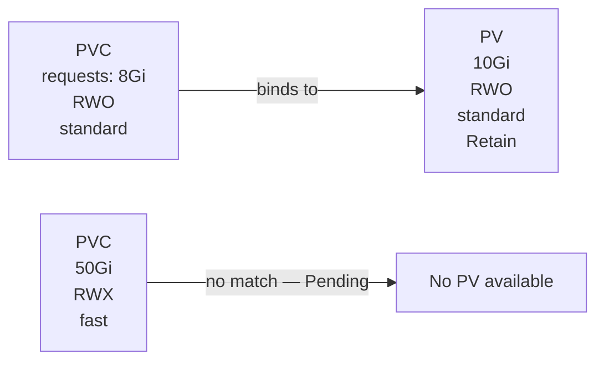
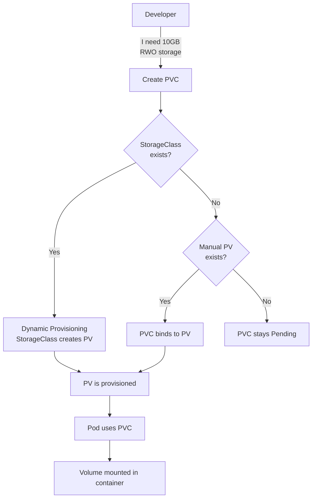

# 06 — Storage

> Persistent data in Kubernetes — Volumes, PVCs, StorageClasses

---

## Table of Contents

1. [Kubernetes Storage Model](#kubernetes-storage-model)
2. [Volumes](#volumes)
3. [PersistentVolume (PV)](#persistentvolume-pv)
4. [PersistentVolumeClaim (PVC)](#persistentvolumeclaim-pvc)
5. [StorageClass](#storageclass)
6. [Stateful Storage with StatefulSets](#stateful-storage-with-statefulsets)
7. [Storage Patterns & Best Practices](#storage-patterns--best-practices)

---

## Kubernetes Storage Model

```mermaid
flowchart LR
    subgraph Storage[Kubernetes Storage]
        Pod --> PVC[PersistentVolumeClaim<br/>"I need 10GB fast storage"]
        PVC --> SC[StorageClass<br/>provisioner: ebs.csi.aws.com]
        SC --> PV[PersistentVolume<br/>10GB EBS volume]
        PV --> Physical[Actual Disk<br/>AWS EBS / GCE PD / Local SSD]
    end
```

### Key Concepts

| Concept | Description | Analogy |
|---------|-------------|---------|
| **Volume** | Storage mounted into a pod | USB drive |
| **PersistentVolume (PV)** | Cluster storage resource (provisioned by admin) | Network drive |
| **PersistentVolumeClaim (PVC)** | Request for storage by a user | Request form for disk space |
| **StorageClass** | Defines storage types (fast, slow, encrypted) | Storage catalog |

---

## Volumes

Volumes are mounted directly into pods. They have the same lifecycle as the pod.

### emptyDir

Ephemeral storage that's created when a pod starts, deleted when the pod is removed.

```yaml
apiVersion: v1
kind: Pod
metadata:
  name: cache-pod
spec:
  containers:
    - name: app
      image: nginx:alpine
      volumeMounts:
        - name: cache
          mountPath: /cache
    - name: log-collector
      image: busybox
      command: ["sh", "-c", "tail -f /logs/*"]
      volumeMounts:
        - name: logs
          mountPath: /logs
  volumes:
    - name: cache
      emptyDir:
        sizeLimit: 500Mi               # Limit disk usage
        medium: Memory                  # Use RAM (tmpfs) — fastest
    - name: logs
      emptyDir: {}                     # Default — on disk
```

### hostPath

Mounts a directory from the host node's filesystem into the pod.

```yaml
apiVersion: v1
kind: Pod
metadata:
  name: hostpath-pod
spec:
  containers:
    - name: app
      image: nginx:alpine
      volumeMounts:
        - name: host-log
          mountPath: /var/log/host
  volumes:
    - name: host-log
      hostPath:
        path: /var/log
        type: Directory           # Directory | File | Socket | DirectoryOrCreate
```

**Warning:** hostPath is a security risk — the pod can access any host file. Only use for node-level daemons (Fluentd, monitoring agents).

### configMap / secret

Mounted as files from ConfigMap or Secret resources.

```yaml
volumes:
  - name: config
    configMap:
      name: app-config
      defaultMode: 0644
      items:
        - key: config.yaml
          path: app.yaml
  - name: creds
    secret:
      secretName: db-secret
      defaultMode: 0400
```

### nfs

Mount an NFS share.

```yaml
volumes:
  - name: nfs
    nfs:
      server: 192.168.1.100
      path: /exports/data
      readOnly: false
```

---

## PersistentVolume (PV)

A PV is a piece of storage in the cluster provisioned by an administrator or dynamically by a StorageClass.

```yaml
apiVersion: v1
kind: PersistentVolume
metadata:
  name: manual-pv
  labels:
    type: local
spec:
  capacity:
    storage: 10Gi
  volumeMode: Filesystem                # Filesystem | Block
  accessModes:
    - ReadWriteOnce                     # RWO | ROX | RWX
  persistentVolumeReclaimPolicy: Retain # Retain | Delete | Recycle
  storageClassName: manual
  hostPath:
    path: /mnt/data
```

### Access Modes

| Mode | Abbreviation | Description |
|------|-------------|-------------|
| **ReadWriteOnce** | RWO | Mounted as read-write by a single node |
| **ReadOnlyMany** | ROX | Mounted as read-only by many nodes |
| **ReadWriteMany** | RWX | Mounted as read-write by many nodes |
| **ReadWriteOncePod** | RWOP | Mounted by a single pod (K8s 1.22+) |

### Reclaim Policy

| Policy | Behavior |
|--------|----------|
| **Retain** | PV retained after PVC deletion (manual cleanup) |
| **Delete** | PV and underlying storage deleted |
| **Recycle** | PV scrubbed and available again (deprecated) |

### Volume Modes

| Mode | Description | Use Case |
|------|-------------|----------|
| **Filesystem** | Mounted as a directory | Most apps |
| **Block** | Raw block device | Databases (higher performance) |

---

## PersistentVolumeClaim (PVC)

A PVC is a request for storage by a user.

```yaml
apiVersion: v1
kind: PersistentVolumeClaim
metadata:
  name: myapp-pvc
  namespace: default
spec:
  accessModes:
    - ReadWriteOnce
  resources:
    requests:
      storage: 8Gi
  storageClassName: standard            # Must match PV's class
  selector:                             # Optional — match specific PV
    matchLabels:
      type: local
```

### PVC → PV Binding



```bash
# PVC will be Pending until a matching PV exists or StorageClass provisions one
kubectl get pvc
# NAME        STATUS    VOLUME   CAPACITY   STORAGECLASS   AGE
# myapp-pvc   Pending                                     5s
# myapp-pvc   Bound     pvc-abc  10Gi       standard       10s  ← After binding
```

### Using PVC in a Pod

```yaml
apiVersion: v1
kind: Pod
metadata:
  name: myapp
spec:
  containers:
    - name: app
      image: myapp:latest
      volumeMounts:
        - name: data
          mountPath: /app/data
  volumes:
    - name: data
      persistentVolumeClaim:
        claimName: myapp-pvc
        readOnly: false
```

---

## StorageClass

StorageClasses enable **dynamic provisioning** — PVs are created automatically when a PVC requests storage.

```yaml
apiVersion: storage.k8s.io/v1
kind: StorageClass
metadata:
  name: fast
provisioner: ebs.csi.aws.com          # Depends on your cloud provider
parameters:
  type: gp3
  iops: "3000"
  throughput: "125"
  encrypted: "true"
allowVolumeExpansion: true
reclaimPolicy: Delete
volumeBindingMode: WaitForFirstConsumer  # Immediate | WaitForFirstConsumer
```

### Common StorageClass Provisioners

| Provider | Provisioner |
|----------|-------------|
| **AWS** | `ebs.csi.aws.com` (block), `efs.csi.aws.com` (NFS) |
| **GCP** | `pd.csi.storage.gke.io` |
| **Azure** | `disk.csi.azure.com` (disk), `file.csi.azure.com` (file) |
| **Minikube** | `k8s.io/minikube-hostpath` |
| **Local** | `kubernetes.io/no-provisioner` |

### Default StorageClass

```bash
# Check default
kubectl get storageclass
# NAME                 PROVISIONER                RECLAIMPOLICY   VOLUMEBINDINGMODE
# standard (default)   k8s.io/minikube-hostpath   Delete          Immediate
# fast                 ebs.csi.aws.com            Delete          WaitForFirstConsumer

# Set a StorageClass as default
kubectl patch storageclass fast -p '{"metadata": {"annotations":{"storageclass.kubernetes.io/is-default-class":"true"}}}'
```

### WaitForFirstConsumer

```yaml
volumeBindingMode: WaitForFirstConsumer
# PV is not provisioned until a pod using the PVC is scheduled
# Ensures the PV is created in the same availability zone as the pod
```

---

## Stateful Storage with StatefulSets

StatefulSets use **volumeClaimTemplates** to create unique PVCs for each pod.

```yaml
apiVersion: apps/v1
kind: StatefulSet
metadata:
  name: postgres
spec:
  serviceName: postgres
  replicas: 3
  selector:
    matchLabels:
      app: postgres
  template:
    metadata:
      labels:
        app: postgres
    spec:
      containers:
        - name: postgres
          image: postgres:16-alpine
          volumeMounts:
            - name: data
              mountPath: /var/lib/postgresql/data
  volumeClaimTemplates:
    - metadata:
        name: data
      spec:
        accessModes: ["ReadWriteOnce"]
        resources:
          requests:
            storage: 10Gi
        storageClassName: standard
```

```bash
# Each pod gets its own PVC
kubectl get pvc
# NAME                STATUS   VOLUME
# data-postgres-0     Bound    pvc-abc
# data-postgres-1     Bound    pvc-def
# data-postgres-2     Bound    pvc-ghi
```

### Scaling StatefulSets

```bash
# Scale up
kubectl scale statefulset postgres --replicas=5
# Creates: postgres-3, postgres-4 + PVCs: data-postgres-3, data-postgres-4

# Scale down
kubectl scale statefulset postgres --replicas=2
# Deletes: postgres-4, postgres-3, postgres-2 (in reverse order)
# PVCs are NOT deleted — data is preserved
```

---

## Storage Patterns & Best Practices

### Pattern 1: Database

```yaml
apiVersion: apps/v1
kind: StatefulSet
metadata:
  name: mysql
spec:
  serviceName: mysql
  replicas: 1
  selector:
    matchLabels:
      app: mysql
  template:
    spec:
      containers:
        - name: mysql
          image: mysql:8.0
          env:
            - name: MYSQL_ROOT_PASSWORD
              valueFrom:
                secretKeyRef:
                  name: mysql-secret
                  key: password
          volumeMounts:
            - name: data
              mountPath: /var/lib/mysql
  volumeClaimTemplates:
    - metadata:
        name: data
      spec:
        accessModes: ["ReadWriteOnce"]
        resources:
          requests:
            storage: 50Gi
        storageClassName: fast
```

### Pattern 2: Shared Filesystem (RWX)

```yaml
apiVersion: v1
kind: PersistentVolumeClaim
metadata:
  name: shared-storage
spec:
  accessModes:
    - ReadWriteMany                    # Must support RWX
  resources:
    requests:
      storage: 100Gi
  storageClassName: efs                # AWS EFS, NFS, or similar
---
apiVersion: apps/v1
kind: Deployment
metadata:
  name: file-processor
spec:
  replicas: 3
  selector:
    matchLabels:
      app: processor
  template:
    spec:
      containers:
        - name: processor
          image: processor:latest
          volumeMounts:
            - name: shared
              mountPath: /data
      volumes:
        - name: shared
          persistentVolumeClaim:
            claimName: shared-storage
```

### Pattern 3: Ephemeral Cache

```yaml
apiVersion: apps/v1
kind: Deployment
metadata:
  name: cache
spec:
  replicas: 3
  template:
    spec:
      containers:
        - name: cache
          image: redis:7-alpine
          volumeMounts:
            - name: cache
              mountPath: /data
      volumes:
        - name: cache
          emptyDir:
            medium: Memory
            sizeLimit: 1Gi
```

### Storage Quick Reference

| Use Case | Volume Type | Access Mode | Example |
|----------|-------------|-------------|---------|
| **Database** | PVC via StatefulSet | RWO | PostgreSQL, MySQL |
| **Shared files** | PVC with RWX | RWX | NFS, EFS, GlusterFS |
| **Cache/temp** | emptyDir (Memory) | — | Redis, temp files |
| **Config files** | configMap | RO | App configuration |
| **Credentials** | secret | RO | TLS certs, passwords |
| **Node logs** | hostPath | RWO | Fluentd, monitoring |
| **Block device** | PVC with volumeMode: Block | RWO | High-performance DB |

### Commands

```bash
# StorageClasses
kubectl get storageclasses
kubectl describe storageclass standard

# PersistentVolumes
kubectl get pv
kubectl describe pv pvc-abc123
kubectl delete pv pvc-abc123

# PersistentVolumeClaims
kubectl get pvc
kubectl describe pvc myapp-pvc

# Expand a PVC (if StorageClass supports it)
kubectl patch pvc myapp-pvc -p '{"spec":{"resources":{"requests":{"storage":"20Gi"}}}}'

# Check pod volumes
kubectl describe pod myapp | grep -A 5 Volumes
```

---

## Summary



| Concept | Purpose |
|---------|---------|
| **Volume** | Storage attached to a pod |
| **PersistentVolume** | Cluster storage resource |
| **PersistentVolumeClaim** | User's request for storage |
| **StorageClass** | Templates for provisioning storage |
| **volumeClaimTemplates** | Per-pod PVCs in StatefulSets |

---

## Next Steps

→ [07 — Helm](./07-helm.md)
