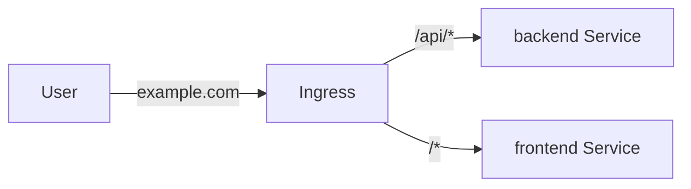

# 09 — Interview Questions

> Common Kubernetes interview questions — from fundamentals to advanced

---

## Table of Contents

1. [Fundamentals](#fundamentals)
2. [Pods & Containers](#pods--containers)
3. [Workload Resources](#workload-resources)
4. [Networking](#networking)
5. [Configuration & Secrets](#configuration--secrets)
6. [Storage](#storage)
7. [Security & RBAC](#security--rbac)
8. [Cluster Administration](#cluster-administration)
9. [Troubleshooting](#troubleshooting)
10. [Design & Architecture](#design--architecture)

---

## Fundamentals

### Q: What is Kubernetes and why would you use it?

**A:** Kubernetes is an open-source container orchestration platform that automates deployment, scaling, and management of containerized applications. Use it for:
- **High availability** — self-healing, auto-restart, auto-replace
- **Scaling** — horizontal pod autoscaling, cluster autoscaling
- **Rolling updates** — zero-downtime deployments
- **Resource efficiency** — bin packing, resource limits
- **Portability** — runs on any cloud, on-prem, or hybrid

### Q: Explain the architecture of a Kubernetes cluster.

**A:** A Kubernetes cluster has two planes:

**Control plane (master):**
- `kube-apiserver` — REST API entry point
- `etcd` — distributed key-value store (cluster state)
- `kube-scheduler` — assigns pods to nodes
- `kube-controller-manager` — runs controllers (deployment, replicaset, etc.)
- `cloud-controller-manager` — cloud provider integrations

**Data plane (worker nodes):**
- `kubelet` — node agent, manages pods
- `kube-proxy` — network routing, iptables/IPVS
- Container runtime — Docker, containerd, CRI-O

### Q: What is etcd and why is it important?

**A:** etcd is a distributed, consistent key-value store used as Kubernetes' backing store for all cluster data. It holds the desired state, configuration, secrets, and metadata. It's critical because:
- **Single source of truth**
- Uses Raft consensus for consistency
- Must be backed up regularly
- If etcd goes down, the cluster is effectively read-only

### Q: What's the difference between Docker and Kubernetes?

**A:** Docker creates and runs containers; Kubernetes orchestrates them across multiple hosts. Docker Swarm is Docker's native orchestrator; Kubernetes is the industry standard.

### Q: Explain the pod lifecycle states.

**A:** `Pending` → `Running` → `Succeeded`/`Failed`

- **Pending** — accepted by API server, waiting for container creation
- **Running** — all containers running
- **Succeeded** — all containers completed successfully (Jobs)
- **Failed** — at least one container terminated with error
- **CrashLoopBackOff** — container keeps crashing and restarting
- **ImagePullBackOff** — image pull failed

---

## Pods & Containers

### Q: What is a Pod?

**A:** The smallest deployable unit in Kubernetes. A pod wraps one or more containers that share:
- Network namespace (same IP, localhost)
- Storage volumes
- Lifecycle

### Q: When would you put multiple containers in one pod?

**A:** When they need to share resources and are tightly coupled:
- **Sidecar** — log shipper (Fluentd alongside app)
- **Ambassador** — proxy (Redis client via localhost)
- **Adapter** — metric format converter

### Q: Explain init containers.

**A:** Init containers run before app containers start, sequentially, to completion. Use cases:
- Wait for a database to be ready
- Run database migrations
- Set up file permissions
- Pre-populate configuration

### Q: What are liveness, readiness, and startup probes?

**A:**
- **Liveness probe** — Checks if container is alive. If fails → restarts the container.
- **Readiness probe** — Checks if container is ready to serve traffic. If fails → removes from Service endpoints.
- **Startup probe** — Used for slow-starting containers. Delays liveness/readiness checks until startup probe succeeds.

### Q: How do you set resource limits and requests?

```yaml
resources:
  requests:                    # Minimum guaranteed
    cpu: 250m
    memory: 256Mi
  limits:                      # Hard cap
    cpu: 500m                  # Throttled if exceeded
    memory: 512Mi              # OOM killed if exceeded
```

### Q: What happens when a pod exceeds its memory limit?

**A:** The container gets OOM killed (terminated with code 137). Kubernetes will restart it according to the restart policy.

### Q: What happens when a pod exceeds its CPU limit?

**A:** The container is throttled (slowed down), not killed. It will run slower than expected.

---

## Workload Resources

### Q: Compare Deployment, StatefulSet, and DaemonSet.

**A:**

| Resource | Use Case | Pod Identity | Scaling | Ordering |
|----------|----------|--------------|---------|----------|
| **Deployment** | Stateless apps | Random | Arbitrary | No guarantees |
| **StatefulSet** | Stateful apps (DBs) | Stable (`pod-N`) | Ordered | Ordered graceful |
| **DaemonSet** | Node-level (monitoring) | One per node | N/A | N/A |

### Q: When would you use a Job vs a CronJob?

**A:**
- **Job** — Run once (batch processing, data migration)
- **CronJob** — Schedule recurring tasks (backups, report generation, cleanup)

### Q: Explain the deployment strategy options.

**A:**
- **RollingUpdate** (default) — Gradually replace pods (zero-downtime)
- **Recreate** — Kill all old pods, then create new ones (downtime)

For rolling updates, you can also use:
- **Blue/Green** — Two deployments, switch Service selector
- **Canary** — Route small % of traffic to new version
- **A/B testing** — Route based on headers/cookies

### Q: What's the difference between a HorizontalPodAutoscaler and a VerticalPodAutoscaler?

**A:**
- **HPA** — Scales number of pod replicas based on CPU/memory/custom metrics
- **VPA** — Adjusts CPU/memory requests of existing pods

---

## Networking

### Q: Explain the four networking models Kubernetes solves.

**A:**
1. **Container-to-Container** — localhost (same pod)
2. **Pod-to-Pod** — Each pod gets a cluster-unique IP, direct routing (no NAT)
3. **Pod-to-Service** — Services provide stable virtual IPs + DNS
4. **External-to-Service** — Ingress, LoadBalancer, or NodePort

### Q: What's the difference between ClusterIP, NodePort, LoadBalancer, and ExternalName?

**A:**
- **ClusterIP** (default) — Internal virtual IP, accessible only within cluster
- **NodePort** — Opens a static port (30000-32767) on every node → ClusterIP
- **LoadBalancer** — Cloud load balancer → NodePort → ClusterIP
- **ExternalName** — DNS CNAME to external service (no proxy)

### Q: Explain how Ingress works.

**A:** Ingress is a Layer 7 (HTTP/HTTPS) entry point that routes traffic to Services. It handles:
- Path-based routing (`/api` → backend, `/` → frontend)
- Host-based routing (`api.example.com` → backend)
- TLS termination
- Virtual hosting



### Q: What is kube-proxy and how does it work?

**A:** kube-proxy runs on every node, maintaining network rules. It implements the Service abstraction:
- **iptables** (default) — DNAT rules for each Service endpoint
- **IPVS** — kernel-level load balancing (better performance for large clusters)
- **userspace** — deprecated

### Q: How do Network Policies work?

**A:** Network Policies control pod-to-pod traffic using labels. They are implemented by the CNI plugin (Calico, Cilium, Weave). By default, all pod-to-pod traffic is allowed.

```yaml
spec:
  podSelector:
    matchLabels:
      app: api
  policyTypes:
    - Ingress
    - Egress
  ingress:
    - from:
        - podSelector:
            matchLabels:
              app: frontend
  egress:
    - to:
        - podSelector:
            matchLabels:
              app: db
```

### Q: What is the difference between Ingress and a Load Balancer?

**A:** A LoadBalancer (L4, TCP/UDP) gives each Service its own external IP. Ingress (L7, HTTP/HTTPS) provides a single entry point that routes to multiple Services based on hostname/path.

---

## Configuration & Secrets

### Q: What's the difference between a ConfigMap and a Secret?

**A:** Both store key-value data. ConfigMaps for non-sensitive config; Secrets for sensitive data (passwords, tokens). Secrets are base64-encoded (not encrypted by default). Secrets support encryption at rest via `kube-apiserver --encryption-provider-config`.

### Q: How do you securely store secrets in Kubernetes?

**A:** For real security in production:
- Enable encryption at rest (`EncryptionConfiguration`)
- Use RBAC to restrict secret access
- Use **External Secrets Operator** or **Sealed Secrets**
- Integrate with HashiCorp Vault, AWS Secrets Manager, etc.
- Never commit raw secrets to Git

### Q: How do ConfigMap updates propagate to pods?

**A:**
- **Volume mounts** — Updated automatically (eventually consistent, few seconds delay)
- **Environment variables** — NOT updated; pod must be restarted (`kubectl rollout restart`)
- **SubPath mounts** — NOT updated

### Q: What is a ServiceAccount and when would you create one?

**A:** A ServiceAccount provides identity for processes in pods. You'd create a custom ServiceAccount when a pod needs specific permissions:
- Access the Kubernetes API
- Interact with cloud provider APIs (IRSA, Workload Identity)
- Operate with least-privilege (override the default ServiceAccount)

---

## Storage

### Q: Explain the difference between emptyDir, hostPath, and PersistentVolume.

**A:**
- **emptyDir** — Ephemeral, pod-scoped. Deleted with pod. Good for cache, scratch space.
- **hostPath** — Mounts host node filesystem. Persistent across pod restarts but not portable.
- **PersistentVolume** — Cluster storage resource. Survives pod restarts, portable across nodes.

### Q: Explain PV/PVC/StorageClass binding flow.

**A:**
1. Admin provisions a PV (or StorageClass enables dynamic provisioning)
2. User creates a PVC requesting storage (size, access mode)
3. Kubernetes finds a matching PV (or StorageClass provisions one)
4. PVC binds to PV
5. Pod uses PVC as a volume

### Q: What access modes are available for PVCs?

**A:**
- **ReadWriteOnce** (RWO) — Single node read-write
- **ReadOnlyMany** (ROX) — Many nodes read-only
- **ReadWriteMany** (RWX) — Many nodes read-write
- **ReadWriteOncePod** (RWOP) — Single pod (1.22+)

### Q: When would you use a StatefulSet instead of a Deployment for stateful apps?

**A:** StatefulSet guarantees:
- Stable, unique network identity (pod-0, pod-1)
- Stable, persistent storage (each pod gets its own PVC)
- Ordered, graceful deployment and scaling
- Ordered, graceful termination

Deployments don't guarantee ordering or stable identity.

### Q: What is `volumeClaimTemplates`?

**A:** A StatefulSet feature that creates a unique PVC for each replica:

```yaml
volumeClaimTemplates:
  - metadata:
      name: data
    spec:
      accessModes: ["ReadWriteOnce"]
      resources:
        requests:
          storage: 10Gi
```

Creates: `data-postgres-0`, `data-postgres-1`, `data-postgres-2`

---

## Security & RBAC

### Q: Explain the principle of least privilege in Kubernetes.

**A:** Grant the minimum permissions necessary:
- Don't use the default ServiceAccount for pods
- Use namespaced Roles (not ClusterRoles) when possible
- Drop all Linux capabilities, add only what's needed
- Set `runAsNonRoot: true`
- Set `readOnlyRootFilesystem: true`
- Use Pod Security Standards (Restricted profile)

### Q: What's the difference between Role and ClusterRole?

**A:**
- **Role** — Grants permissions within a specific namespace
- **ClusterRole** — Grants permissions cluster-wide (non-namespaced resources: nodes, PVs, namespaces) or can be bound to a namespace via RoleBinding

### Q: What is a PodSecurityPolicy (PSP) and why was it deprecated?

**A:** PSP enforced security policies on pods (runAsUser, SELinux, capabilities) but was replaced by **Pod Security Standards** (PSS) because PSP was complex, confusing, and easy to misconfigure. PSS uses admission controller labels on namespaces with three levels: Privileged, Baseline, Restricted.

### Q: How does authentication work in Kubernetes?

**A:** Multiple strategies:
- **X.509 certificates** (kubeconfig)
- **ServiceAccount tokens** (JWT)
- **OpenID Connect** (OIDC)
- **Webhook token authentication**
- **Static token / password file**

### Q: What is a Pod Disruption Budget?

**A:** PDB limits the number of pods that can be voluntarily disrupted at a time:

```yaml
apiVersion: policy/v1
kind: PodDisruptionBudget
spec:
  minAvailable: 2
  maxUnavailable: 1
  selector:
    matchLabels:
      app: myapp
```

---

## Cluster Administration

### Q: How does the scheduler work?

**A:** The scheduler watches for unscheduled pods (`.spec.nodeName` is empty) and:
1. **Filtering** — Filter nodes that satisfy pod constraints (resources, affinity, taints)
2. **Scoring** — Rank remaining nodes by priority (resource usage, affinity rules)
3. **Binding** — Assign the pod to the highest-scoring node

### Q: What are taints and tolerations?

**A:**
- **Taint** — Applied to nodes to repel pods that don't tolerate the taint
- **Toleration** — Applied to pods to allow scheduling on tainted nodes

```bash
kubectl taint node minikube gpu=true:NoSchedule
```

```yaml
tolerations:
  - key: "gpu"
    operator: "Equal"
    value: "true"
    effect: "NoSchedule"
```

Effects: `NoSchedule`, `PreferNoSchedule`, `NoExecute`

### Q: Compare taints/tolerations with node affinity.

| Feature | Taints/Tolerations | Node Affinity |
|---------|-------------------|---------------|
| **Purpose** | Repel pods from nodes | Attract pods to nodes |
| **Default behavior** | Pods scheduled unless tolerated | Pods not scheduled unless match |
| **Use case** | Dedicated nodes (GPU, infra) | Prefer certain nodes |

### Q: What are the different upgrade strategies for a cluster?

**A:**
- **In-place upgrade** — Upgrade control plane components one by one
- **Blue/green cluster** — Create new cluster alongside old, migrate workloads
- **Managed K8s** — Let cloud provider handle (EKS, GKE, AKS)

### Q: How do you back up and restore a cluster?

**A:**
1. **etcd backup** — snapshot etcd (most critical)
   ```bash
   ETCDCTL_API=3 etcdctl snapshot save backup.db
   ```
2. **Resource YAML** — `kubectl get all --all-namespaces -o yaml`
3. **Velero** — Tool for backup/restore with cloud storage

### Q: What is the role of kubelet?

**A:** The kubelet is the node agent that:
- Registers the node with the cluster
- Watches for pod assignments (via API server)
- Ensures containers are running (via container runtime)
- Reports node/pod status back to API server
- Runs liveness/readiness probes

---

## Troubleshooting

### Q: A pod is stuck in Pending. What do you check?

**A:**
1. `kubectl describe pod <name>` — Check events
2. `kubectl get nodes` — Are there schedulable nodes?
3. `kubectl describe node` — Check resources (CPU/memory/pods)
4. Check PVC status (if the pod uses storage)
5. Check if there are matching taints/affinities
6. Check if a resource quota or limit range is blocking

### Q: A pod is in CrashLoopBackOff. What do you check?

**A:**
1. `kubectl logs <pod>` — Check application logs
2. `kubectl logs <pod> --previous` — Logs from the crashed container
3. `kubectl describe pod <pod>` — Check last state, exit code, restart count
4. Check config/secret mounts (are they correct?)
5. Check resource limits (OOMKilled?)
6. Check liveness probe configuration

### Q: A Service isn't accessible. What do you check?

**A:**
1. `kubectl get endpoints` — Does the Service have endpoints?
2. `kubectl get pods -l <selector>` — Are matching pods running?
3. `kubectl describe svc <name>` — Check selector, ports, type
4. `kubectl describe pod <pod>` — Is the pod ready?
5. Check NetworkPolicies (blocking traffic?)
6. Check kube-proxy logs
7. Try `kubectl port-forward` to bypass service

### Q: kubectl can't connect to the cluster. What do you check?

**A:**
1. `kubectl cluster-info` — Is the API server reachable?
2. `kubectl config view` — Is the context correct?
3. Check kubeconfig file (`~/.kube/config`)
4. Check if minikube/docker-desktop is running
5. `minikube status` for Minikube issues
6. Check network connectivity / firewall rules

### Q: How do you debug a network issue between pods?

**A:**
1. Deploy a debug pod: `kubectl run debug --image=nicolaka/netshoot -it -- /bin/bash`
2. Test DNS: `nslookup kubernetes.default`
3. Test connectivity: `curl <pod-ip>:<port>`, `ping <pod-ip>`
4. Check NetworkPolicies: `kubectl get networkpolicies`
5. Check CNI plugin (Calico, Cilium) logs
6. Check node iptables rules

---

## Design & Architecture

### Q: Design a highly available application on Kubernetes.

**A:**
- **Multi-zone/region** — Use `podAntiAffinity` and `topologySpreadConstraints`
- **Horizontal scaling** — HPA with CPU/custom metrics
- **Zero-downtime deployments** — RollingUpdate, PDB, maxSurge, maxUnavailable
- **Health checks** — Configure liveness, readiness, startup probes
- **Load balancing** — Ingress controller with multiple replicas
- **Data durability** — StatefulSets with replicated storage (RWO for primary, RWX for replicas)
- **Disaster recovery** — Regular etcd backups, Velero for resource backup

### Q: How would you migrate from one cloud provider to another?

**A:**
1. **Abstraction** — Use abstractions (StorageClasses, Ingress controllers) not provider-specific
2. **Use Helm** — Template-driven, parameterize cloud-specific values
3. **Data migration** — For stateful apps, replicate data in advance
4. **DNS cutover** — Use weighted DNS, gradually shift traffic
5. **Run in parallel** — Run both clusters, validate, cut over
6. **Rollback plan** — Keep old cluster for at least 1 week

### Q: What are some anti-patterns to avoid?

**A:**
- **Running databases without backups** — Always use PV + snapshots/backup solution
- **Putting everything in one namespace** — Use namespaces for isolation
- **Not setting resource limits** — Noisy neighbor problems
- **Using `latest` image tag** — Unpredictable; use semantic versions or commit SHA
- **Hardcoding config in images** — Use ConfigMaps
- **No health checks** — Pods may serve traffic while broken
- **Storing secrets in ConfigMaps** — Use Secrets
- **Everything as a Deployment** — Sometimes StatefulSet or DaemonSet is appropriate
- **Not using readiness probes** — Pods receive traffic before ready

### Q: How do you approach monitoring and observability in Kubernetes?

**A:**
- **Metrics** — Prometheus (metrics-server, kube-state-metrics, node-exporter)
- **Logging** — Fluentbit/Fluentd → Elasticsearch/Loki
- **Tracing** — OpenTelemetry / Jaeger
- **Dashboards** — Grafana (K8s mixin dashboards)
- **Alerting** — Prometheus Alertmanager (integrate with PagerDuty, Slack)
- **Cost monitoring** — Kubecost / OpenCost

### Q: Explain the difference between requests and limits.

**A:**
- **Requests** — What the container is guaranteed. Used by scheduler for node selection. Reserved on the node.
- **Limits** — Hard cap the container cannot exceed. CPU throttled, memory OOM killed.

**QoS classes:**
| Class | Requests == Limits | Requests set, Limits unset | Neither set |
|-------|-------------------|---------------------------|-------------|
| **Guaranteed** | ✅ | — | — |
| **Burstable** | — | ✅ | — |
| **BestEffort** | — | — | ✅ |

### Q: What is Helm and why use it over plain kubectl?

**A:** Helm packages Kubernetes YAML into reusable charts. Benefits:
- **Reusability** — Chart once, deploy anywhere
- **Templating** — Dynamic YAML with Go templates
- **Dependency management** — Sub-charts (Redis, PostgreSQL)
- **Version management** — `helm list`, `helm rollback`
- **Environment management** — Values files per env (dev/staging/prod)

---

## Quick Reference by Seniority

### Junior Level (0-2 years)
- Pod lifecycle, probes, resource limits
- kubectl basics (get, describe, logs, exec)
- Deployment, Service, ConfigMap, Secret basics
- Understanding of cluster architecture

### Mid Level (2-5 years)
- StatefulSets, DaemonSets, Jobs, CronJobs
- Ingress, Network Policies, PVC/StorageClass
- RBAC, ServiceAccounts, Pod Security Standards
- Helm chart authoring
- Troubleshooting skills

### Senior Level (5+ years)
- Cluster upgrades, etcd backup/restore
- Custom controllers, operators, CRDs
- Admission webhooks, OPA/Gatekeeper
- Multi-cluster management
- Capacity planning, cluster autoscaling
- Security hardening, CIS benchmarks

---

## Next Steps

→ [10 — Practical Problems](./10-practical-problems.md)
